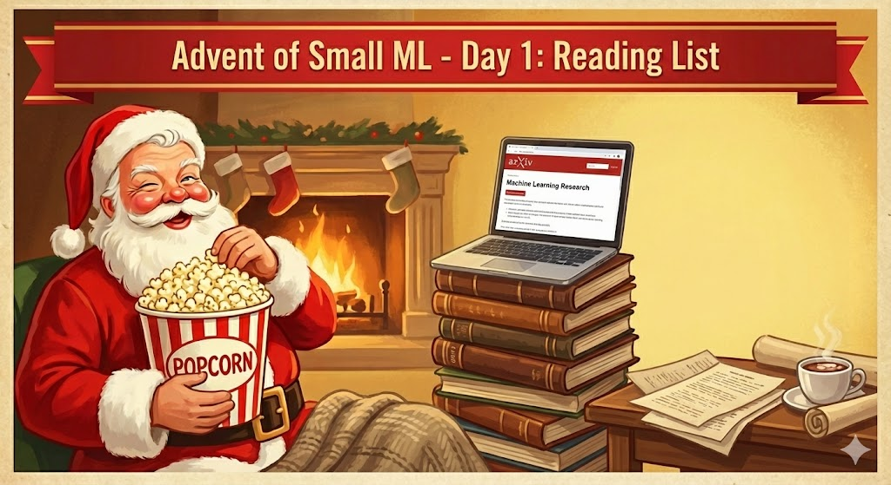

# Day 1 - Reading List

## Overview

Over the last couple of months, I've bookmarked hundreds of papers, repos, and startup ideas. I used today as a forcing function to process the backlog: I went through them all, filtered out the noise, and condensed them into a single list of the top ~80.

Everything included is noteworthy, but I've added tiered ratings and my own notes to each one.

(I'm thinking of making this a monthly post/substack, a ranked list of papers alongside the high level trends of where I see things moving. Weekly was a bit much, but monthly feels right).

**Note:** Day 24 will cover the end-of-year catch-up. This covers July → early November.

## The List

**[📄 Full Reading List (Google Doc)](https://docs.google.com/document/d/1dGl7CjUjI2LtA8YQd6a_wSb53kinLDOVi6F6Eyu2sho/edit?usp=sharing)**

The document includes:
- ~80 curated papers, repos, and startup ideas
- Tiered ratings for each entry
- Personal notes and commentary

