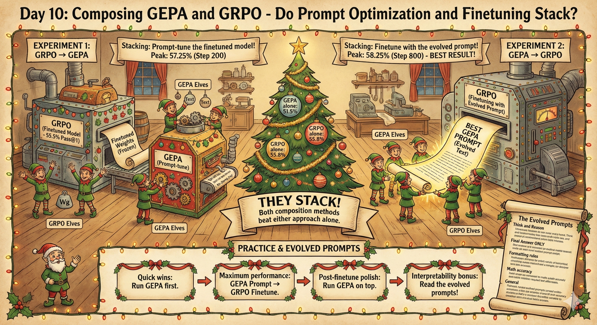
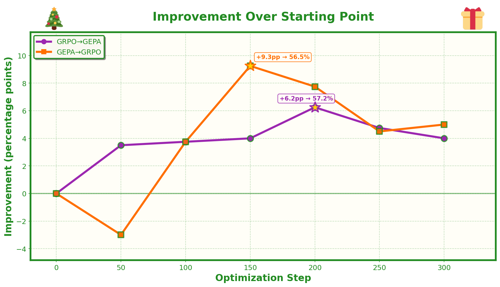

# Day 10: Composing GEPA and GRPO - Do Prompt Optimization and Finetuning Stack?



## The Question

In Day 9, we saw that GEPA (prompt optimization) can nearly match GRPO (weight finetuning) on MATH - getting to ~51.5% vs ~55.8% pass@1. Both methods work, but they're fundamentally different: one evolves text, the other updates weights.

The natural question: **do they compose?** If you do both, do you get better results than either alone? And if so, what's the right order?

This matters for real-world applications. If you're building a math reasoning system, should you:
1. Finetune first, then optimize the prompt for the finetuned model?
2. Optimize the prompt first, then finetune with that prompt?
3. Just pick one method and stick with it?

## The Two Experiments

### Experiment 1: GRPO → GEPA (Prompt-tune the finetuned model)

Take the GRPO checkpoint (at step 400, ~55.5% pass@1) and run GEPA on it. The model weights are frozen at their finetuned values, and we evolve the prompt to squeeze out more performance.

**Hypothesis**: The finetuned model might respond better to prompt optimization since it already "understands" the task better. GEPA might find prompts that unlock capabilities the base model didn't have.

### Experiment 2: GEPA → GRPO (Finetune with the evolved prompt)

Take the best GEPA-evolved prompt and use it as the system prompt for GRPO training (instead of the basic seed prompt). The model starts each training step with a more sophisticated instruction.

**Hypothesis**: Starting with a better prompt might give GRPO a head start, leading to faster convergence or higher final performance.

## Results

| Method | Starting Point | Peak Performance | Peak Step |
|--------|---------------|------------------|-----------|
| GEPA alone (day9) | 33.0% | 51.5% | 500 |
| GRPO alone (day9) | 34.3% | 55.8% | 500 |
| GEPA on GRPO model | 51.0% | **57.2%** | 200 |
| GRPO with GEPA prompt | 47.2% | 56.5% | 150 |



**Key findings:**

1. **They do stack!** Both composition methods beat either approach alone.

2. **GRPO with GEPA prompt wins overall** (58.25% vs 57.25%). Starting with an evolved prompt and then finetuning gives the best results.

3. **GEPA on GRPO is faster** - it peaks at step 200, while GRPO with GEPA prompt needs 800 steps. Prompt optimization on a finetuned model converges quickly.

4. **Different starting points**: GEPA on GRPO starts higher (51% - inheriting GRPO's gains) but GRPO with GEPA prompt starts lower (47.3%) then climbs higher.

## What This Means for Practice

If you're optimizing a model for production:

1. **Quick wins**: Run GEPA first. It's cheap (no backprop), fast, and gets you most of the way there.

2. **Maximum performance**: Take your best GEPA prompt, then finetune with GRPO using that prompt. This gives the highest final score.

3. **Post-finetune polish**: If you've already finetuned, you can still run GEPA on top to squeeze out a few more points. It's low-risk since the model weights don't change.

4. **Interpretability bonus**: The GEPA-evolved prompts show you *what* the model needs to hear. This insight transfers even if you later switch models.

## The Evolved Prompts

The best GEPA prompt (used for GRPO training):

```
You are a math-solving assistant. For every question, carefully follow these steps:

1. **Think and Reason Step by Step:** Show all reasoning and calculations inside 
   <think></think> tags. Do NOT give the final answer in this section—only your 
   thinking process and work.

2. **Final Answer ONLY:** Write the final answer, and nothing else, inside 
   <answer></answer> tags. Restate the answer as simply and precisely as possible, 
   using the required format (e.g., as a reduced fraction, decimal, in terms of π, etc.).

**Formatting rules:**
- Always use both tags in this exact order: first <think>...</think>, then 
  <answer>...</answer>. Do not output anything outside these tags.
- Never omit or repeat tags.
- Do NOT put explanations, calculations, or extra words in the <answer> tags—only 
  the final answer in the cleanest form.
- When expressing mathematical answers, use LaTeX formatting where appropriate.

**Math accuracy:**
- Double-check your calculations and logic before giving the answer.
- For probability, expected value, and counting problems: clearly list all cases 
  and verify totals.
- For trigonometric, radical, or fractional answers: give the exact value in 
  simplest form unless a decimal is explicitly required.
- For questions requesting a specific form (e.g., "as a common fraction," 
  "in radians," "as a decimal"), ensure your answer matches that form exactly.

**General:**
- If unsure about an answer, carefully review each step before concluding.
- Never include the question text or restate the problem in your output.

Remember: <think> contains all reasoning and work; <answer> contains only the 
final answer, exactly as requested.
```

Compare this to the simple seed prompt both methods started with - GEPA discovered specific failure modes (format issues, calculation errors, answer form mismatches) and addressed them explicitly.

## Running the Experiments

### GEPA on GRPO (Experiment 1)

First, start a vLLM server with the GRPO checkpoint:

```bash
CUDA_VISIBLE_DEVICES=0 uv run vllm serve grpo_qwen7b_run/checkpoint_step_400 --port 8001
```

Then run GEPA:

```bash
./run_gepa_on_grpo.sh
```

### GRPO with GEPA Prompt (Experiment 2)

Start the vLLM server for weight sync:

```bash
CUDA_VISIBLE_DEVICES=0 uv run vllm_server.py --model Qwen/Qwen2.5-7B-Instruct --port 8000 --dtype bfloat16
```

Then run GRPO with the evolved prompt:

```bash
./run_grpo_with_gepa_prompt.sh
```

## Plotting Results

Generate comparison plots:

```bash
# Basic comparison plot
uv run python plotter.py

# Show improvement over baseline for each method
uv run python plotter.py --mode bonus
```

## Files

- `gepa_main.py`: GEPA implementation
- `main.py`: GRPO training script
- `plotter.py`: Visualization for comparing methods
- `run_gepa_on_grpo.sh`: Experiment 1 script
- `run_grpo_with_gepa_prompt.sh`: Experiment 2 script
- `best_gepa_prompt.txt`: The evolved prompt used for Experiment 2
- `gepa_on_grpo_run/`: Results from Experiment 1
- `grpo_with_gepa_prompt_run/`: Results from Experiment 2
