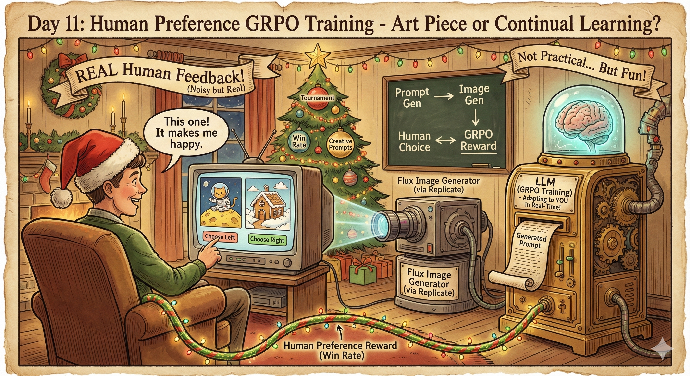
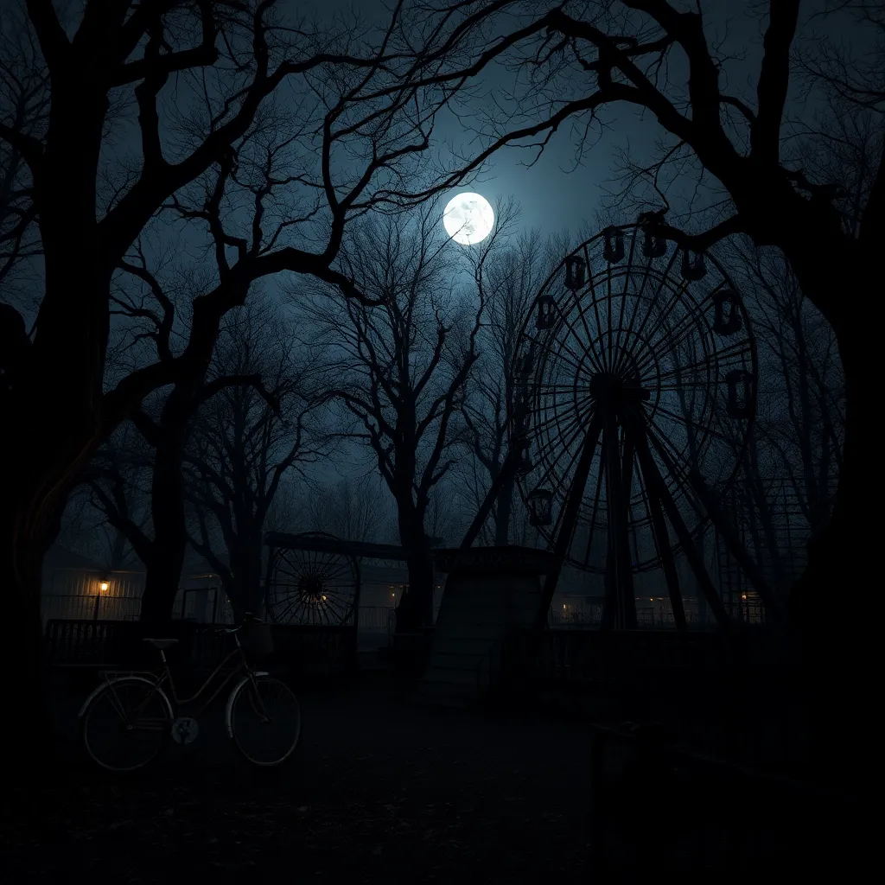
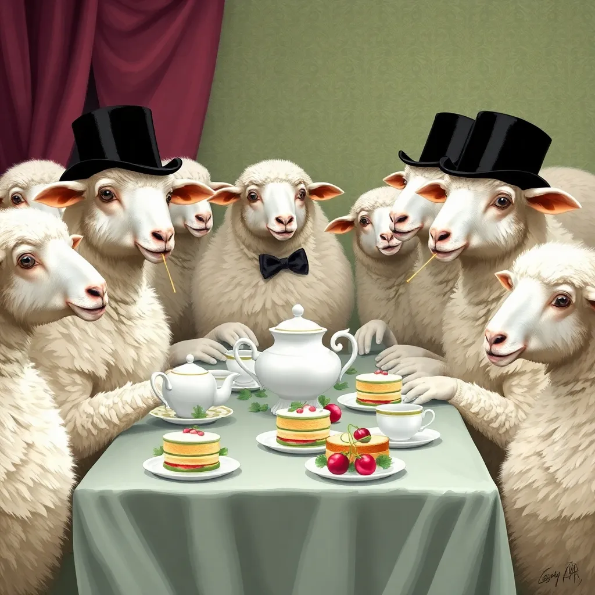
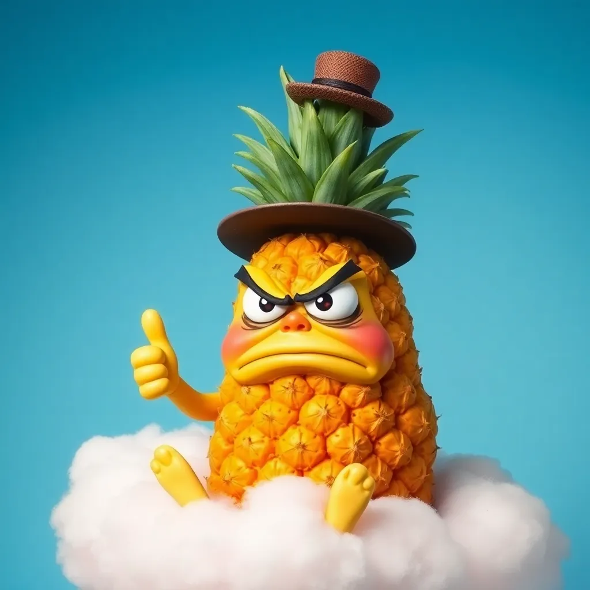

# Human Preference GRPO Training

Train a language model to write image generation prompts that make people happy, using human preference feedback via round-robin tournaments.



## Why This Exists

**Let's be clear: this is not practical.** You're sitting there clicking through image comparisons while a 7B model waits on a GPU somewhere. It doesn't scale. That's kind of the point.

I've tried a bunch of LLM-as-a-judge setups for preference learning and they all fall apart in interesting ways—the judge has its own biases, it can't actually see the images, it optimizes for what *sounds* good rather than what *looks* good. So this is the experiment: what if you just... used a human? The signal is noisy (your preferences shift, you get tired, you're inconsistent), but it's *real*. Maybe 50-100 rounds of genuine human feedback is enough to move the needle. Turns out it is.

There's also something interesting here as an art piece. The definitions get fuzzy, but this is almost continual learning—a model adapting to a single human's aesthetic preferences in real time, during a single session. You're not training on a frozen dataset of what humans liked last year. You're in the loop, and the model is responding to *you*, right now.

Also its very fun. You start to notice what the model learns that makes you laugh—the weird visual motifs it picks up on, the themes it gravitates toward because you kept choosing them. It actually works, and watching it happen is satisfying in a way that checking eval metrics isn't.

## Demo

<video src="figs/Day11.mp4" controls width="100%"></video>

## Results

Here's what it looks like in practice. After ~20-50 rounds of clicking through tournaments, the model noticeably shifts toward whatever you've been rewarding.

**"Scary" run — start vs. end:**

| Start | End |
|-------|-----|
|  |  |

**"Funny" run — start vs. end:**

| Start | End |
|-------|-----|
|  |  |

## How It Works

1. **Prompt Generation**: Model generates 4 creative prompts for image generation (configurable)
2. **Image Generation**: Each prompt is sent to Flux (via Replicate) to generate an image
3. **Tournament**: All 6 pairwise matchups are shown to the user via web UI
4. **Human Feedback**: User picks left or right for each matchup
5. **Reward**: Win rate (wins/3) becomes the reward for each prompt
6. **GRPO Training**: Backpropagate the rewards to improve the model

Note: With 4 rollouts you get 6 comparisons. With 8 rollouts you get 28 comparisons (can be tedious!).

## Files

| File | Purpose |
|------|---------|
| `train.py` | Main training loop |
| `llms.py` | Qwen2.5-7B-Instruct model loading and generation |
| `image_gen.py` | Flux image generation via Replicate |
| `tournament.py` | Round-robin tournament logic + Flask web UI |
| `logging_utils.py` | Saves images, prompts, metrics per round |

## Quick Start

```bash
# Set your Replicate API token
export REPLICATE_API_TOKEN="your_token_here"

# Install dependencies
pip install -r requirements.txt

# Run training
python train.py --output_dir my_run --num_rounds 50

# Visit http://localhost:5000 to participate in tournaments
```

## SLURM Cluster Support

The tournament UI uses **Gradio with `share=True`**, which creates a temporary public URL like `https://abc123.gradio.live`. This works seamlessly on SLURM clusters - no SSH tunneling needed!

When you run training, watch the console output for:
```
Running on public URL: https://xxxxxxxx.gradio.live
```

Open that URL from anywhere (your laptop, phone, etc.) to participate in tournaments.

## Arguments

```
--model_name        Model to train (default: Qwen/Qwen2.5-7B-Instruct)
--output_dir        Where to save checkpoints and logs
--num_rounds        Number of training rounds
--num_rollouts      Prompts per round (default: 4, use 8 for more diversity)
--temperature       Sampling temperature (default: 0.9)
--learning_rate     Learning rate (default: 5e-6)
--save_every        Checkpoint frequency (default: 10)
--no_share          Disable public Gradio URL (local only)
--meta_prompt       Custom meta-prompt for generation
--resume_from       Resume from checkpoint path
```

## Output Structure

```
my_run/
├── config.json           # Training configuration
├── checkpoints/          # Model checkpoints
│   └── checkpoint_0010/
│       ├── model.pt
│       └── checkpoint_info.json
├── logs/
│   └── training_log.json # Per-round metrics
└── rounds/
    └── round_0001/
        ├── image_0.png   # Generated images
        ├── prompt_0.txt  # Prompts with win rates
        ├── round_data.json
        └── summary_grid.png
```

## Tournament UI

The Gradio web UI presents pairs of images for comparison:
- **Buttons**: Click "Choose Left" or "Choose Right"
- **Progress**: Shows current matchup (e.g., "Matchup 3 of 6")
- All matchups must be completed before training continues
- Works from any device with the public Gradio link

## Encouraging Diversity

The prompts are designed to push the model toward creative, non-clichéd outputs. If you find the model getting stuck on similar themes:
- Increase `--temperature` (default 1.2, try 1.4+)
- Use a custom `--meta_prompt` that explicitly asks for variety
- The system prompt tells the model to be "avant-garde" and avoid repetition

