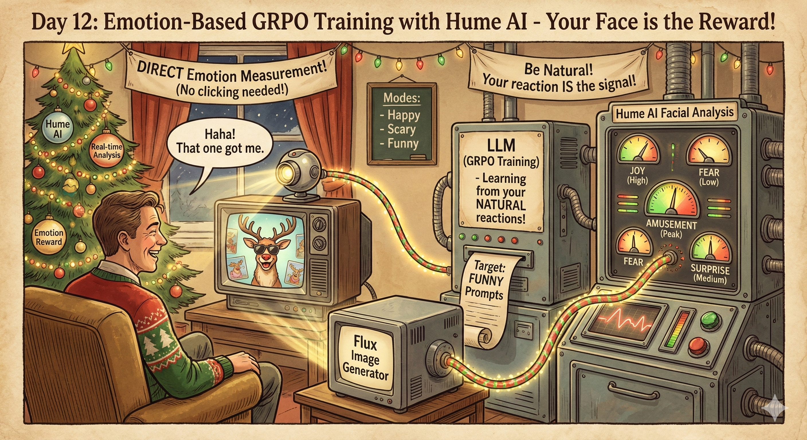
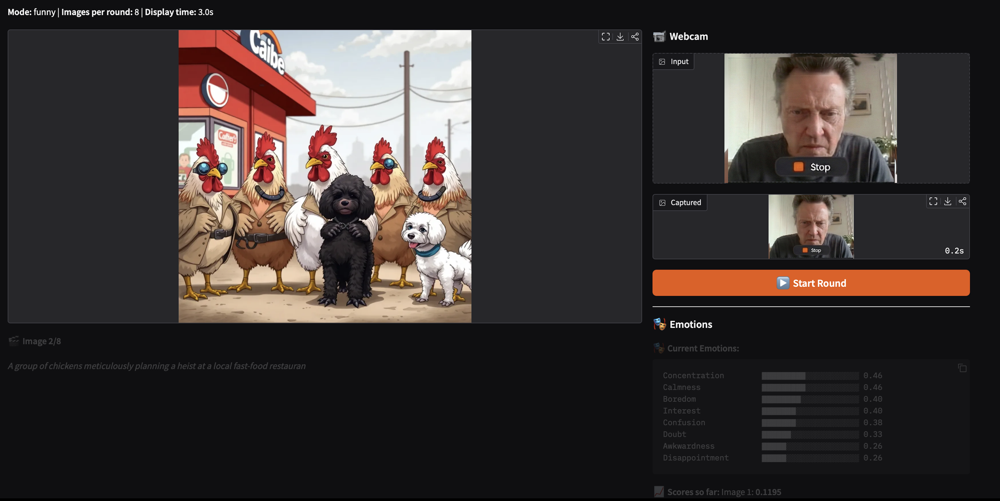

# Day 12: Emotion-Based GRPO Training with Hume AI



Train a language model to write image generation prompts that evoke target emotions, using facial expression analysis as the reward signal.

## How It Works

1. **Prompt Generation**: Model generates creative prompts for image generation
2. **Image Generation**: Each prompt is sent to Flux (via Replicate) to generate an image
3. **Slideshow**: Images auto-advance in a web UI while your webcam captures reactions
4. **Facial Analysis**: Hume AI's streaming API analyzes your facial expressions in real-time
5. **Reward Signal**: Emotional deviation from baseline becomes the GRPO reward
6. **Learning**: Model learns to write prompts that make you react!

## Key Difference from Day 11

Instead of pairwise comparisons (tournament), we use **direct emotion measurement**:
- No more choosing left vs right
- Just look at each image naturally
- Your facial expression IS the reward
- Hume AI extracts all 48 emotions (Joy, Amusement, Fear, etc.)

## Quick Start

```bash
# Set API keys
export REPLICATE_API_TOKEN="your_replicate_token"
export HUME_API_KEY="your_hume_key"

# Run training
python simple_train.py --mode funny --output_dir my_run --num_rounds 20
```

## Modes

The `--mode` argument determines which meta-prompt is used:

| Mode | Target Emotions |
|------|-----------------|
| `happy` | Joy, Amusement, Excitement, Interest |
| `scary` | Fear, Horror, Anxiety, Distress |
| `funny` | Amusement, Joy, Surprise (positive) |

## Usage Flow

1. Run `python simple_train.py`
2. Open the Gradio URL in your browser
3. Each round:
   - Model generates prompts → Flux creates images
   - Click **Start Round** when ready
   - Images display one at a time (auto-advancing)
   - Webcam captures your reaction per image
   - Hume analyzes emotions in real-time (~1s per image)
4. Emotion deviation scores become rewards
5. Model updates via GRPO
6. Repeat!



## Arguments

```
--model_name        Model to train (default: Qwen/Qwen2.5-7B-Instruct)
--output_dir        Where to save logs and images
--mode              Target emotion: happy, scary, or funny
--num_rounds        Number of training rounds (default: 10)
--num_images        Images per round (default: 8)
--display_time      Seconds per image (default: 3.0)
--temperature       Sampling temperature (default: 1.0)
--learning_rate     Learning rate (default: 5e-6)
--no_share          Disable public Gradio URL
```

## Output Structure

```
my_run/
├── training_log.json
└── round_0001/
    ├── image_0.png
    ├── image_1.png
    ├── ...
    ├── reaction_0.jpg
    ├── reaction_1.jpg
    ├── ...
    └── round_data.json
```

## Requirements

- Hume AI API key (get one at https://hume.ai)
- Replicate API token (for Flux image generation)
- Webcam access in browser
- Good lighting for reliable face detection

## Tips

- **Lighting matters**: Ensure your face is well-lit for reliable emotion detection
- **Be natural**: Don't try to fake reactions - genuine responses train better models
- **Consistent environment**: Similar lighting/position across rounds helps
- **Face the camera**: Make sure Hume can detect your face clearly
