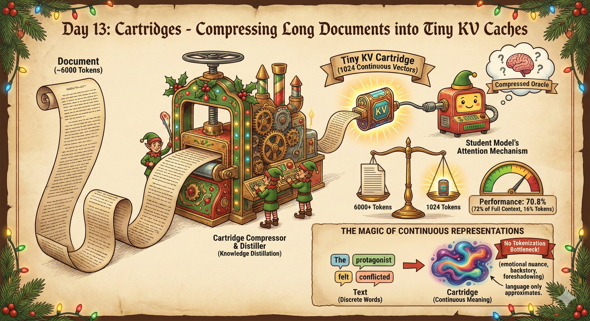

# Cartridges: Compressing Long Documents into Tiny KV Caches



## The Magic of Continuous Representations

What if you could compress a 6,000+ token document into just 1,024 learnable vectors? That's what cartridges do—and they might actually learn *better* representations than the original text.

Here's the key insight: **text is discrete, but meaning is continuous**. When you write "The protagonist felt conflicted about leaving her hometown," you're forced to pick specific words. But the *actual* semantic content—the emotional nuance, the implied backstory, the foreshadowing—lives in a high-dimensional continuous space that language only approximates.

A cartridge is a **continuous, learnable KV cache** that gets injected directly into the model's attention mechanism. Because it's continuous (not forced through a discrete vocabulary), it can potentially encode information more efficiently than text:

- **No tokenization bottleneck**: Text must be chunked into tokens; cartridges operate in embedding space directly
- **Learnable compression**: The cartridge learns what information is actually needed to answer questions
- **Soft attention targets**: Can blend multiple concepts without needing explicit words for each

The training process uses **knowledge distillation**: a teacher model sees the full document, a student model sees only the cartridge, and we train the cartridge to make the student mimic the teacher. The cartridge learns to be a compressed oracle.

---

## How It Works

1. **Load Document**: Pick a story from the QuALITY dataset (long-form reading comprehension)
2. **Initialize Cartridge**: Start from text-based KV states (not random!) for faster convergence
3. **Self-Study**: Model generates synthetic Q&A pairs with teacher logits (top-k probabilities)
4. **Distillation**: Train via sparse cross-entropy loss on teacher's top-k predictions
5. **Evaluation**: Compare accuracy on held-out multiple choice questions

```
┌─────────────────────────────────────────────────────────────┐
│ Traditional:  [Document ~6000 tokens] + [Question] → Answer │
│ Cartridge:    [Cartridge ~1024 tokens] + [Question] → Answer│
└─────────────────────────────────────────────────────────────┘
```

## Quick Start

```bash
# Train a cartridge with synthetic evaluation questions
uv run python simple_train.py \
    --output my_run \
    --tokens 1024 \
    --steps 500 \
    --eval-every 25 \
    --synthetic-eval 50

# Plot the results
uv run python plot.py --output my_run
```

## Files

| File | Purpose |
|------|---------|
| `simple_train.py` | Main training script |
| `plot.py` | Plot training progress (Christmas themed!) |
| `plot_experiments.py` | Compare results across experiments |

## Key Arguments

```
--output              Output directory (default: output)
--model               Model name (default: Qwen/Qwen2.5-7B-Instruct)
--tokens              Number of cartridge tokens (default: 512)
--steps               Training steps (default: 200)
--lr                  Learning rate (default: 2e-2)
--eval-every          Evaluate every N steps (default: 50)
--num-samples         Samples per question for pass@k (default: 5)
--max-questions       Max original QuALITY questions (default: 15)
--story-idx           Which QuALITY story to use (default: 0)

# Initialization
--init-mode           'text' (default) or 'random'
                      Text mode initializes from actual document KV states

# Learning rate schedule  
--no-cosine-schedule  Disable cosine annealing (enabled by default)

# Synthetic evaluation (highly recommended!)
--synthetic-eval N    Generate N additional MC questions via OpenAI API
--synthetic-eval-local N  Generate via local model instead
--synthetic-eval-model    OpenAI model to use (default: gpt-4.1-mini)
```

## Training Details

### Text-Based Initialization

Instead of random initialization, we run a prefix of the document through the model and extract the resulting KV cache. This gives the cartridge a "warm start" in meaningful embedding space—dramatically faster convergence than random.

### Sparse Top-K Cross-Entropy Loss

Full KL divergence over 150k+ vocabulary tokens is wasteful. Instead:
1. During Q&A generation, store the teacher's **top-20 token probabilities** for each answer position
2. During training, compute cross-entropy only over these 20 tokens
3. This focuses learning on the tokens that actually matter

### Cosine Learning Rate Schedule

Uses cosine annealing with 10% warmup for stable training. The relatively high learning rate (2e-2) works because we're only training the cartridge parameters, not the full model.

## Output Structure

```
my_run/
├── experiment.json           # Config and final results
├── article.txt               # The source document
├── synthetic_qa.json         # Training Q&A with teacher logits
├── eval_questions.json       # All evaluation questions
├── training_log.json         # Loss per step
├── eval_step_*.json          # Accuracy checkpoints
├── eval_final_cartridge.json # Final accuracy
└── training_plot.png         # Visualization
```

## Example Results

With 1024 cartridge tokens compressing a 6460 token article:


```
Full context baseline:    98.5%  (upper bound)
Trained cartridge:        70.8%  (our method @ step 500)  
Initial cartridge:        20.0%  (before training)
```

The cartridge achieves ~72% of full-context performance with only 16% of the tokens!

## Tips

- **More tokens = more capacity**: 1024 tokens works well for ~6000 token documents
- **Text initialization matters**: Random init requires 10x more training steps
- **Synthetic eval is essential**: 15 questions from QuALITY has high variance; add 50+ synthetic MC questions
- **Watch for overfitting**: If eval accuracy drops while loss decreases, reduce steps

## References

Based on the [Cartridges paper](https://arxiv.org/abs/2501.xxxxx) from Hazy Research. This is a simplified educational implementation focusing on clarity over performance.
