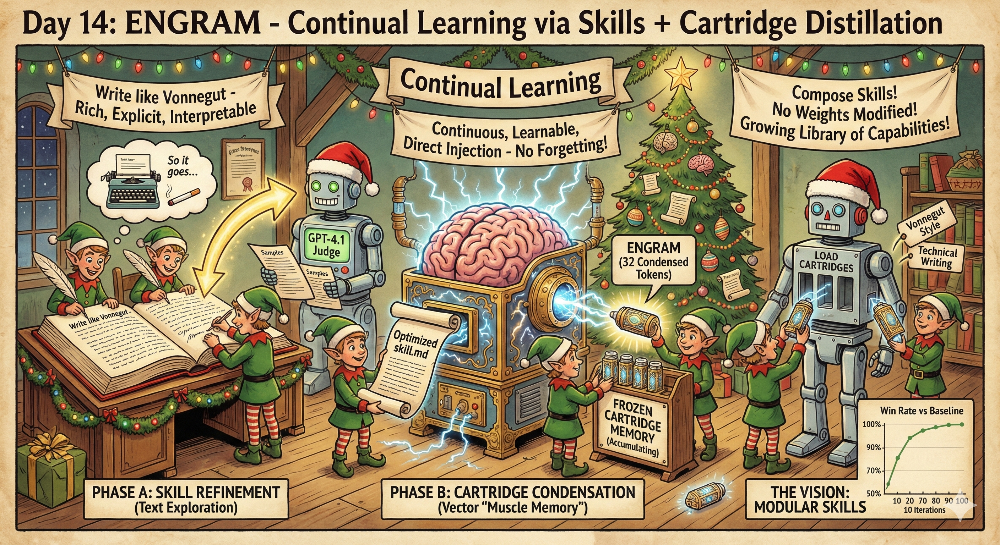
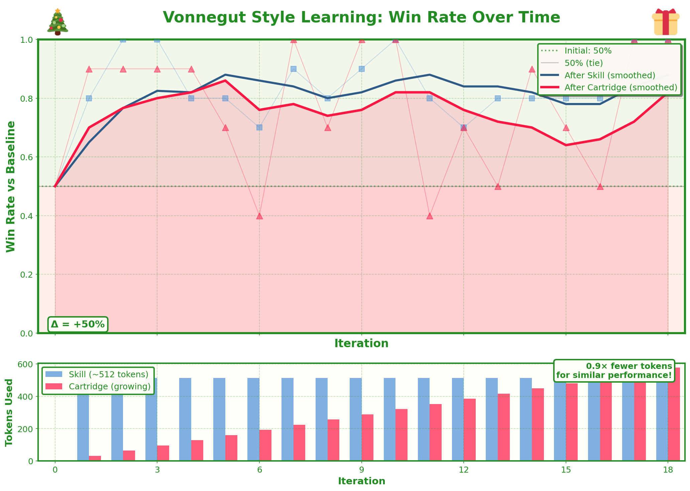

# Day 14: ENGRAM - Continual Learning via Skills + Cartridge Distillation

**ENGRAM**: *Evolving Natural-language Gradually Refined into Attention Memory*

## What I'm Trying to Do

This is my attempt at a **continual learning method** that doesn't touch model weights.

The core idea: mimic how humans learn. When you learn a new skill, you don't immediately commit it to long-term memory. You:
1. **Work through it consciously** — reasoning, taking notes, following instructions
2. **Practice until it becomes automatic** — the explicit knowledge fades but the skill remains
3. **Build on top** — now you can learn the next thing, with the old skill as foundation

I want to do the same thing with LLMs:
1. **Skills** (text files) — Rich, explicit prompting on how to do something. Fully in-context, interpretable, easy to iterate on.
2. **Cartridges** (KV cache tensors) — Compressed "muscle memory" distilled from the skill. Fewer tokens, faster, potentially *better* than the text.
3. **Repeat** — Throw out the skill, start fresh, but keep the cartridge. Layer new learning on top.

The interesting part to me is this transition: **from purely in-context → to something more like weights**. Cartridges fit perfectly here - they're learnable vectors injected into the model's attention, but they don't modify the base weights. And in theory, you could go even further and distill the cartridge into actual weight updates (though I don't do that last step here).

---

## The Architecture

```
┌─────────────────────────────────────────────────────────────────────┐
│                         EACH ITERATION                              │
├─────────────────────────────────────────────────────────────────────┤
│                                                                      │
│   ┌──────────────────────────────────────────────────────────────┐  │
│   │ PHASE A: Skill Refinement (GEPA-lite)                        │  │
│   │                                                              │  │
│   │   • Start with blank skill: "Write like Vonnegut"            │  │
│   │   • Generate samples → GPT-4.1 judges → GPT-4.1 updates skill│  │
│   │   • Repeat 10 rounds                                         │  │
│   │   • Output: optimized skill.md for this iteration            │  │
│   └──────────────────────────────────────────────────────────────┘  │
│                              ↓                                       │
│   ┌──────────────────────────────────────────────────────────────┐  │
│   │ PHASE B: Cartridge Condensation                              │  │
│   │                                                              │  │
│   │   • Teacher = model + skill.md (full text context)           │  │
│   │   • Student = model + cartridge (32 learned tokens)          │  │
│   │   • Distill teacher → student via cross-entropy              │  │
│   │   • Freeze these 32 tokens, add to growing cartridge         │  │
│   └──────────────────────────────────────────────────────────────┘  │
│                              ↓                                       │
│   ┌──────────────────────────────────────────────────────────────┐  │
│   │ RESET & REPEAT                                               │  │
│   │                                                              │  │
│   │   • Throw out the skill (reset to blank)                     │  │
│   │   • Keep the cartridge (frozen, accumulating)                │  │
│   │   • Next iteration builds on top                             │  │
│   └──────────────────────────────────────────────────────────────┘  │
│                                                                      │
└─────────────────────────────────────────────────────────────────────┘
```

The key insight: **the cartridge is an engram — a condensed memory trace of the skill**. If we miss anything important, the next skill iteration can re-learn it and add more to the engram. Over time, the cartridge accumulates the essential patterns while the skill handles exploration.

---

## The Task: Writing Like Vonnegut

The first thing I wanted to try this on is something I think would be useful for a lot of people: **getting a model to write like you over time**.

As a proxy, I used Kurt Vonnegut — my favorite author. His style is distinctive (short sentences, dark humor, fatalism, "so it goes") and LLMs are good enough at literary analysis to be reasonable judges.

### The Process

1. **Generate**: Model writes a paragraph on a random subject (e.g., "a traffic jam", "a hospital waiting room")
2. **Judge**: GPT-4.1 scores it on a Vonnegut rubric (voice, humor, fatalism, sentence structure, etc.)
3. **Update Skill**: GPT-4.1 sees the samples and scores, then edits the skill.md with specific guidance
4. **Condense**: After 10 rounds, distill the skill into 32 new cartridge tokens
5. **Reset & Repeat**: Skill goes back to blank, cartridge keeps growing

### The Metric

**Win rate vs the base model.** 

For evaluation, I generate samples from:
- Our model (Qwen 2.5 7B + skill + cartridge)
- Base model (same Qwen 2.5 7B, no skill, no cartridge)

GPT-4.1 does head-to-head comparisons on held-out subjects. Win rate = how often our model wins.

---

## Results



**It works!** The model quickly learns to beat the baseline, going from 50% (tie) to nearly 100% win rate within ~10 iterations.

The bottom subplot shows the key efficiency insight: the skill uses ~512 tokens of context, but the cartridge achieves similar performance with far fewer tokens. As training progresses, the cartridge grows but remains more efficient than maintaining full text context.

---

## Why the Cartridge Might Be *Better* Than Text

The cartridge isn't just compression — it's a different kind of representation:

1. **Noise Filtering** — The skill might contain explanations and reasoning scaffolding. The cartridge keeps only what affects outputs.

2. **Continuous Space** — Text is discrete ("be more concise"). Vectors can find the exact activation pattern that produces conciseness.

3. **Direct Injection** — Text requires the model to attend and interpret. The cartridge directly injects the activation patterns.

---

## Quick Start

```bash
# Install dependencies
pip install torch transformers openai

# Set API key for GPT-4.1 judging
export OPENAI_API_KEY="your-key"

# Quick test run (5 iterations)
uv run python vonnegut_train.py --output test_run --iterations 5

# Full run
uv run python vonnegut_train.py --output full_run --iterations 100

# Plot results
uv run python plot.py --output full_run
```

---

## What Gets Logged

Everything is logged for full transparency:

```
output_dir/
├── config.json                    # Run configuration
├── metrics_history.json           # Win rates over time
│
├── skills/                        # Watch skill.md evolve
│   ├── skill_iter_0.md           
│   ├── skill_iter_1.md           
│   └── ...
│
├── training_logs/                 # Full details per iteration
│   └── iter_XXXX.json
│       ├── skill_rounds[]        # Each: prompt, samples, scores, skill changes
│       └── cartridge_training[]  # Each: step, loss
│
├── cartridge_logs/
│   └── cartridge_iter_XXXX.pt   # Loadable checkpoints
│
└── eval_logs/                    # Tournament results
```

---

## Files

| File | Purpose |
|------|---------|
| `vonnegut_train.py` | Main training loop |
| `test_components.py` | Sanity check components |
| `plot.py` | Visualize results (Christmas themed 🎄) |
| `run.sh` | Sample commands |

---

## The Vision

This is a first step toward modular continual learning:

```python
# Future: load skills as files
cartridges = [
    load_cartridge("vonnegut_style.pt"),
    load_cartridge("technical_writing.pt"),
    load_cartridge("your_personal_style.pt"),
]

# Compose them
combined = concatenate_cartridges(cartridges)

# Model now writes with all these skills
response = model.generate(prompt, cartridge=combined)
```

No fine-tuning. No forgetting. Just a growing library of learned capabilities stored as efficient tensor files.

---

## Related Work

- **Cartridges** (Hazy Research): KV cache compression via self-study
- **GEPA**: Genetic evolutionary prompt optimization  
- **Prefix Tuning**: Learnable soft prompts
- **LoRA**: Low-rank adaptation (modifies weights)

**ENGRAM** combines text-based exploration (GEPA-lite) with vector condensation (cartridges) for practical continual learning — mimicking how the brain moves memories from conscious rehearsal to automatic recall.
