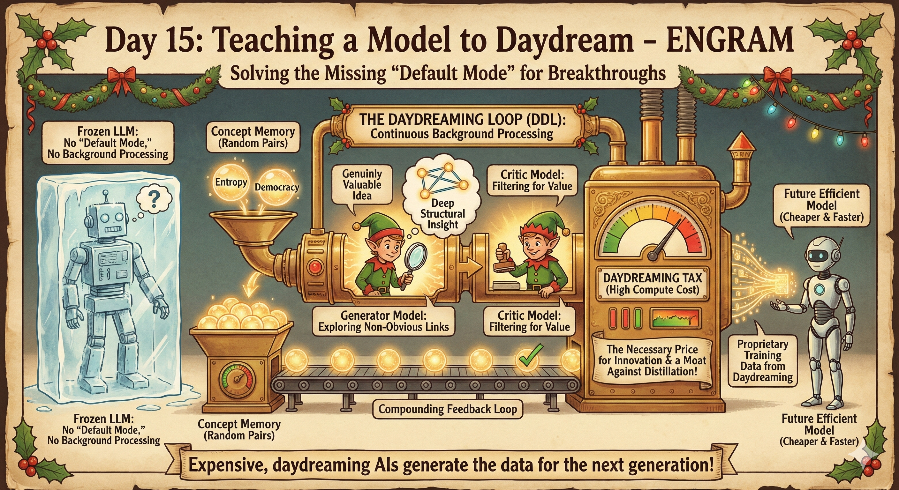
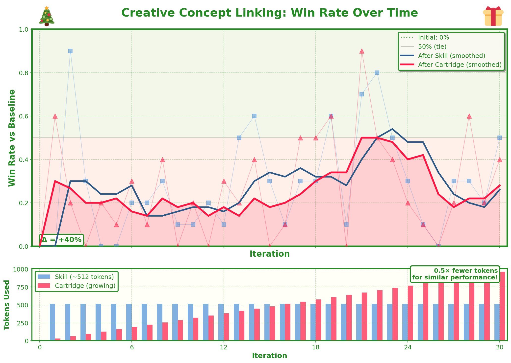

# Day 15: Teaching a Model to Daydream



**ENGRAM**: *Evolving Natural-language Gradually Refined into Attention Memory*

## The Idea

Gwern's [LLM Daydreaming](https://gwern.net/ai-daydreaming) observes something missing from current AI: there's no "default mode." Humans have minds that wander — we make unexpected connections, stumble on insights while showering, wake up with solutions to problems we weren't consciously working on. LLMs just... wait. They're frozen between prompts, unable to think unless asked.

The piece proposes a Daydreaming Loop: let models continuously sample random concepts, explore connections between them, and accumulate the good ones. A kind of unsupervised background process for generating novel thought.

What struck me is that ENGRAM already does something like this. The skill represents *how to think* about a problem. The cartridge compresses that skill into something more fundamental — learned patterns that persist even when the explicit instructions are thrown away.

So: can we teach a model the **skill of creative thinking itself**, then distill that skill into a cartridge? A memory of how to daydream?

---

## The Task: Drawing Connections

Given two random concepts (e.g., "entropy" and "democracy"), find a **novel, coherent, deep connection** between them.

This is harder than it sounds. Most connections are either:
- **Too obvious**: "Both involve change over time" (boring)
- **Too forced**: Random wordplay with no real insight
- **Too shallow**: Surface-level analogies without structural depth

The goal is to find the rare connections that are genuinely insightful — the kind of "aha!" moments that daydreaming produces. The ones where you go "huh, I never thought of it that way."

---

## How It Works

The same two-clock ENGRAM system from Day 14, but now learning to think creatively:

```
┌─────────────────────────────────────────────────────────────────────┐
│                         EACH ITERATION                              │
├─────────────────────────────────────────────────────────────────────┤
│                                                                      │
│   ┌──────────────────────────────────────────────────────────────┐  │
│   │ PHASE A: Learning to See Connections                         │  │
│   │                                                              │  │
│   │   • Sample random concept pair from bank of 50 concepts      │  │
│   │   • Model tries to find a connection                         │  │
│   │   • GPT-4.1 judges: novelty, coherence, depth, generativity  │  │
│   │   • GPT-4.1 updates the skill with better strategies         │  │
│   │   • Repeat 10 rounds                                         │  │
│   └──────────────────────────────────────────────────────────────┘  │
│                              ↓                                       │
│   ┌──────────────────────────────────────────────────────────────┐  │
│   │ PHASE B: Compressing Insight into Memory                     │  │
│   │                                                              │  │
│   │   • Teacher = model + skill (explicit instructions)          │  │
│   │   • Student = model + cartridge (32 learned tokens)          │  │
│   │   • Distill teacher → student via cross-entropy              │  │
│   │   • The cartridge becomes a memory of how to think           │  │
│   └──────────────────────────────────────────────────────────────┘  │
│                              ↓                                       │
│   ┌──────────────────────────────────────────────────────────────┐  │
│   │ RESET & REPEAT                                               │  │
│   │                                                              │  │
│   │   • Throw out skill, keep cartridge                          │  │
│   │   • The skill was scaffolding; the cartridge is the residue  │  │
│   │   • Next iteration builds new insights on top                │  │
│   └──────────────────────────────────────────────────────────────┘  │
│                                                                      │
└─────────────────────────────────────────────────────────────────────┘
```

The interesting part: by the end, the model should be better at finding connections *without* needing the skill text. The cartridge — just 32 tokens per iteration of learned KV cache — carries something the text couldn't fully express.

---

## The Concepts

50 concepts across different domains:

| Category | Examples |
|----------|----------|
| **Philosophical** | consciousness, free will, meaning, death, identity |
| **Scientific** | entropy, evolution, emergence, quantum superposition |
| **Abstract** | paradox, infinity, chaos, symmetry, recursion |
| **Social/Human** | trust, power, culture, love, fear, ritual |
| **Concrete** | a library, a mirror, a bridge, a seed, a storm |

Training uses random pairs from the first 40 concepts.
Evaluation uses held-out pairs involving the last 10 concepts.

---

## What Makes a Good Connection?

Connections are judged on:

1. **NOVELTY**: Is this a connection most people wouldn't think of?
2. **COHERENCE**: Does the connection actually make logical sense?
3. **DEPTH**: Is this a deep structural insight, or just surface wordplay?
4. **GENERATIVITY**: Does this connection spark further ideas?

A 10/10 connection makes you see both concepts differently. A 3/10 is technically valid but forgettable.

---

## Quick Start

```bash
# Install dependencies
pip install torch transformers openai

# Set API key
export OPENAI_API_KEY="your-key"

# Quick test (5 iterations)
uv run python daydream_train.py --output test_run --iterations 5

# Full run
uv run python daydream_train.py --output daydream_run --iterations 100

# Compare against GPT-4.1 as baseline
uv run python daydream_train.py --output vs_gpt4 --baseline-mode external --iterations 50

# Plot results
uv run python plot.py --output daydream_run
```

---

## Results



The model starts at **0% win rate** against the baseline (same model without skill/cartridge). Over 30 iterations, it learns to find better connections, peaking at **90% win rate** around iteration 21.

What's interesting is the noise. Creative thinking doesn't improve monotonically — some iterations the model finds something that works, others it doesn't. The skill text gets rewritten each iteration, so there's genuine exploration happening. But the cartridge accumulates, and over time the overall trend is upward.

By the end, the cartridge has grown to **960 tokens** (30 iterations × 32 tokens each). That's the compressed residue of 30 rounds of learning to see connections.

---

## Why This Matters

Day 14 was about **style** — teaching a model to write like Vonnegut. This is about **thinking** — teaching a model to find non-obvious patterns.

If the cartridge can encode "how to see connections," that's something interesting. It suggests that creative thinking isn't just knowledge, but a *mode* — a way of attending to ideas that can be learned and compressed.

The daydreaming loop proposes that minds need idle time to wander. ENGRAM provides a different angle: maybe you can practice wandering, get better at it, and carry that ability forward as a kind of cognitive muscle memory.

---

## Files

| File | Purpose |
|------|---------|
| `daydream_train.py` | Main training loop |
| `plot.py` | Visualize results (Christmas themed 🎄) |
| `run.sh` | Sample commands |

---

## Related

- **Day 14**: ENGRAM for Vonnegut style (writing style)
- **[LLM Daydreaming](https://gwern.net/ai-daydreaming)**: Gwern's piece on default mode for AI
- **Cartridges**: Hazy Research KV cache compression
