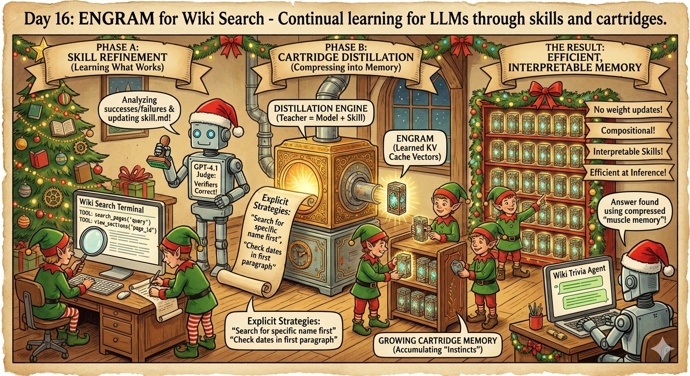
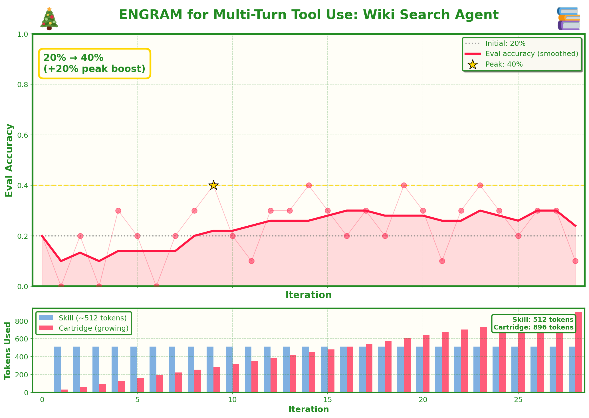

# Day 16: ENGRAM for Wiki Search



**Continual learning for LLMs through skills and cartridges.**

The core idea: LLMs can't truly "learn" from experience—they process each conversation fresh. But what if we could give them a form of persistent memory? ENGRAM explores this by:

1. **Skills**: Text-based instructions that capture *what* the model learns (searchable strategies, common pitfalls, etc.)
2. **Cartridges**: Compressed KV cache vectors that encode the *how*—implicit knowledge distilled from successful skill application

This creates a learning loop: refine skills through trial and error, distill them into cartridges, then reset and repeat. The cartridge grows, accumulating "muscle memory" across iterations.

## This Implementation

We apply ENGRAM to a **multi-turn tool-use agent** for Wikipedia trivia:

- **Environment**: ChromaDB-indexed Wikipedia corpus with `search_pages`, `view_sections`, `read_section` tools
- **Scoring**: [verifiers](https://github.com/PrimeIntellect-ai/verifiers) library's `JudgeRubric` (GPT-4.1)
- **Learning**: Skill refinement → cartridge distillation → repeat

The model learns search strategies: when to search broadly vs. specifically, how to navigate Wikipedia's structure, when it has enough information to answer.

## Setup

```bash
# Install dependencies (including verifiers)
pip install torch transformers chromadb openai datasets verifiers

# Or with uv
uv pip install torch transformers chromadb openai datasets verifiers

# Set API key (for embeddings + judge)
export OPENAI_API_KEY="your-key"
```

## Usage

```bash
# Quick test (5 iterations)
python wiki_engram.py --output test_run --iterations 5

# Full run
python wiki_engram.py --output full_run --iterations 50

# With smaller model
python wiki_engram.py --model Qwen/Qwen2.5-3B-Instruct --iterations 20
```

## Arguments

| Arg | Default | Description |
|-----|---------|-------------|
| `--output` | `wiki_engram_run` | Output directory |
| `--model` | `Qwen/Qwen2.5-7B-Instruct` | Model to use |
| `--iterations` | 20 | Number of outer loop iterations |
| `--skill-rounds` | 5 | Skill refinement rounds per iteration |
| `--cartridge-steps` | 30 | Cartridge training steps per iteration |
| `--tokens-per-iter` | 32 | New cartridge tokens per iteration |
| `--eval-every` | 1 | Run eval every N iterations |
| `--num-eval` | 5 | Number of eval questions |

## Output Structure

```
output_dir/
├── config.json              # Run configuration
├── metrics_history.json     # Accuracy over time
├── skills/
│   ├── skill_iter_0.md      # Initial skill
│   ├── skill_iter_1_after_a.md  # After Phase A
│   └── skill_iter_1.md      # After Phase B
├── cartridges/
│   └── cartridge_0001.pt    # Loadable checkpoints
└── logs/
```

## How It Works

### Phase A: Skill Refinement (Learning What Works)
- Run rollouts on training questions with current skill
- Judge answers with GPT-4.1 via verifiers.JudgeRubric
- GPT-4.1 analyzes successes/failures and updates skill.md
- Skills capture explicit strategies: "search for the specific name first", "check dates in the first paragraph"

### Phase B: Cartridge Distillation (Compressing into Memory)
- Teacher = model + skill (full text in context)
- Student = model + cartridge (learned KV cache vectors)
- Distill via cross-entropy on teacher's top-k logits
- Add new tokens to frozen cartridge each iteration
- The cartridge grows, accumulating compressed "instincts"

### Tool Calling Format

The model uses a simple text-based tool format:
```
TOOL: search_pages("query")
TOOL: view_sections("page_id")
TOOL: read_section("section_id")
```

## What We Use from Verifiers

This script uses `verifiers.JudgeRubric` for answer scoring:

```python
import verifiers as vf

# Create a JudgeRubric with custom prompt
rubric = vf.JudgeRubric(
    judge_client=AsyncOpenAI(),
    judge_model="gpt-4.1",
    parser=vf.Parser(),
    judge_prompt=JUDGE_PROMPT,
)

# Score an answer
judge_response = await rubric.judge(prompt, completion, answer, state)
correct = "yes" in judge_response.lower()
```

This gives us:
- Proper async handling with rate limit protection
- Response caching via state dict
- Clean separation of parsing and judging

## Why Continual Learning?

Standard LLM fine-tuning is expensive and risks catastrophic forgetting. ENGRAM offers an alternative:

- **No weight updates**: The base model stays frozen
- **Compositional**: Cartridges from different domains could theoretically combine
- **Interpretable**: Skills are human-readable; you can see *what* the model learned
- **Efficient**: Cartridge tokens are much cheaper than full context at inference time

The key insight: instead of updating billions of parameters, we learn a small set of KV cache vectors that "prime" the model's attention patterns.

## Results



On our small test set (5 questions), the model started at **0% accuracy** and peaked at **40% accuracy** after skill refinement and cartridge distillation. The learning is noisy—as expected with such a small eval set—but shows the system can improve through the ENGRAM loop.

## Notes

- First run builds the ChromaDB index (may take a few minutes)
- Uses `willcb/rare-wiki-pages` corpus and `willcb/wiki-trivia-questions-v4` dataset
- Judge scoring uses GPT-4.1 via verifiers.JudgeRubric (costs apply)
- Embeddings use `text-embedding-3-small` (costs apply)
