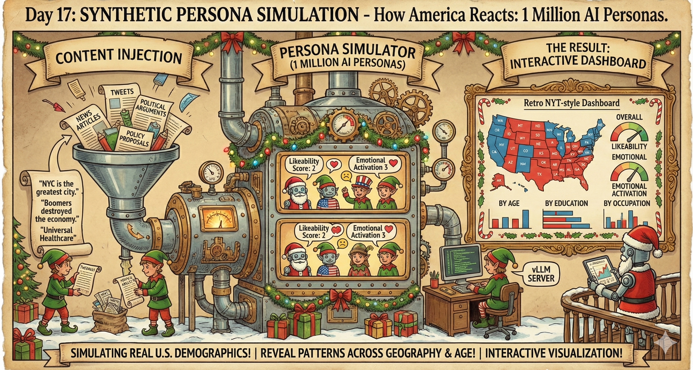

# Day 17: Synthetic Persona Simulation: How America Reacts



Simulate how 1 million AI personas—each embodying real U.S. demographics—react to any content: news articles, tweets, political arguments, policy proposals, and more. Visualize the results with an interactive NYT-style dashboard.

## The Idea

What if you could simulate how the entirety of America—or any demographic subset—would react to a piece of news, a tweet, a political argument, or any content *before* it goes public?

NVIDIA released an incredible dataset: [Nemotron-Personas-USA](https://huggingface.co/datasets/nvidia/Nemotron-Personas-USA)—1 million synthetic personas with detailed backgrounds, occupations, interests, and geographic data that mirror real U.S. demographics. This project uses LLMs to simulate how each persona would genuinely react to any content, revealing patterns across geography, age, education, occupation, and more.

Each persona rates content on two dimensions:
1. **Likeability (1-10)**: Do they like/agree with this?
2. **Emotional Activation (1-10)**: How strongly do they feel about it?

The results reveal fascinating patterns: coastal vs. heartland, young vs. old, educated vs. not, and more.

## How It Works

1. **Load Personas**: 1M synthetic Americans with rich demographic profiles
2. **Prompt LLM**: Ask it to *become* each persona and react to content
3. **Chain-of-Thought**: Model reasons as that persona, then outputs `\boxed{L,E}` ratings
4. **Aggregate**: Compute statistics by state, age, education, occupation, etc.
5. **Visualize**: Interactive React dashboard with maps, histograms, and filters

## Files

| File | Purpose |
|------|---------|
| `batch_simulate.py` | High-throughput async simulation (1M personas) |
| `simulate.py` | Simple single-threaded version for testing |
| `aggregate_results.py` | Process results into visualization-ready JSON |
| `explore_dataset.py` | Inspect the Nemotron personas dataset |
| `exps.sh` | Example commands for server + client |
| `frontend/` | React visualization dashboard |

## Quick Start

### 1. Start the vLLM Server

```bash
# Single GPU
vllm serve Qwen/Qwen2.5-7B-Instruct --port 8000

# Multi-GPU (8x H100s - max throughput)
vllm serve Qwen/Qwen2.5-7B-Instruct \
    --tensor-parallel-size 4 \
    --pipeline-parallel-size 2 \
    --max-num-seqs 2048 \
    --max-num-batched-tokens 65536 \
    --enable-chunked-prefill \
    --disable-log-requests \
    --port 8000
```

### 2. Run Simulation

```bash
# Test with 1K personas
uv run python batch_simulate.py \
    --content "NYC is the greatest city on earth - everyone wants to move here." \
    --output run_nyc \
    --num-personas 1000 \
    --max-concurrent 256

# Full 1M personas (takes ~30 min on 8x H100)
uv run python batch_simulate.py \
    --content "Your content here: news, tweet, argument, policy proposal, etc." \
    --output run_full \
    --max-concurrent 1024 \
    --batch-size 10000
```

### 3. Aggregate Results

```bash
uv run python aggregate_results.py \
    --input run_nyc \
    --output frontend/public/viz_data \
    --include-raw
```

### 4. View Dashboard

```bash
cd frontend
npm install
npm run dev
```

**For local development**: Open http://localhost:3000

**For remote clusters**: Set up SSH port forwarding to access the dashboard from your local machine:

```bash
# From your local machine, create an SSH tunnel
ssh -L 3000:localhost:3000 user@cluster-hostname

# If you need to go through a jump host:
ssh -L 3000:localhost:3000 -J jump-host user@cluster-hostname

# Keep this SSH session open, then open http://localhost:3000 in your browser
```

The `-L` flag creates a local port forward: `-L local_port:remote_host:remote_port`
- `3000` on your local machine → forwards to → `localhost:3000` on the cluster
- The React dev server runs on port 3000 on the cluster
- Your browser connects to localhost:3000, which tunnels through SSH to the cluster

**Alternative: Run in background and use a different local port**
```bash
# Use a different local port (e.g., 8080) to avoid conflicts
ssh -L 8080:localhost:3000 -N -f user@cluster-hostname
# -N: don't execute remote commands
# -f: run in background
# Then open http://localhost:8080
```

## Prompt Format

The simulation uses chain-of-thought prompting with a structured output:

```
You ARE [detailed persona description with background, job, interests, location]...

You're scrolling through social media and see this post:
"[content]"

React HONESTLY as yourself - not as a neutral AI. You have opinions, biases, 
and gut reactions based on your life experiences.

[Rating scale explanation 1-10]

First, briefly explain your gut reaction as this persona (1-2 sentences). 
Then give your final ratings as \boxed{L,E} where L is likeability and E is emotional activation.
```

## Arguments

### batch_simulate.py

```
--content          The content to evaluate: news, tweets, arguments, etc. (required)
--output           Output directory for results
--num-personas     Number of personas to sample (default: all 1M)
--start-idx        Starting index in dataset
--batch-size       Checkpoint every N personas (default: 5000)
--max-concurrent   Concurrent requests to vLLM (default: 256)
--base-url         vLLM server URL (default: http://localhost:8000/v1)
--model            Model name (default: Qwen/Qwen2.5-7B-Instruct)
--resume           Resume from checkpoint
```

### aggregate_results.py

```
--input            Directory with checkpoint.jsonl
--output           Output directory for JSON files
--min-count        Minimum samples per group (default: 5)
--include-raw      Include raw ratings for interactive filtering
--raw-sample       Max raw ratings to include (default: 50000)
```

## Output Structure

```
run_nyc/
├── config.json           # Run configuration
├── checkpoint.jsonl      # Raw results (one JSON per line)
└── summary.json          # Final statistics

frontend/public/viz_data/
├── overall.json          # Global statistics
├── by_state.json         # Aggregated by state
├── by_zipcode.json       # Aggregated by zipcode  
├── by_demographics.json  # By sex, age, education, etc.
├── sample_ratings.json   # Sample responses with reasoning
└── raw_ratings.json      # For interactive filtering (optional)
```

## Visualization Features

The React dashboard includes:

- **Header**: Shows the content being evaluated + methodology
- **Stats Dashboard**: Overall mean ratings with distributions
- **Geographic Map**: Diverging red-white-blue heatmap by state
- **Interactive Filter**: Slice by age, sex, state, education, etc.
- **Demographic Breakdowns**: Histograms by category
- **Sample Responses**: See actual persona reasoning

### Example: NYC Tweet Results

[Day17.mp4](figs/Day17.mp4)

*Interactive dashboard showing how 1M personas react to "NYC is the greatest city on earth"*

## Performance

On 8x H100 GPUs with vLLM:
- ~500-1000 personas/second
- Full 1M dataset in ~20-30 minutes
- Parse failures are tracked and can be retried with `--resume`

## Example Content That Shows Interesting Splits

```bash
# Geographic split (coastal vs heartland) - Tweet
"NYC is the greatest city on earth - everyone wants to move here."

# Age split (generational divide) - Social media post
"Boomers destroyed the economy, bought houses for $50k, and now lecture millennials about avocado toast."

# Education split - Opinion piece
"College is a scam. Trade schools and self-teaching are the real path to success."

# Urban/rural split - Policy argument
"If you need a car to get anywhere, your city has failed you."

# Political argument - Policy proposal
"The federal government should guarantee universal healthcare coverage for all Americans."

# News headline
"Tech companies announce major layoffs as AI automation accelerates."
```

## Tips

- **Polarizing content works best**: Neutral statements give neutral responses
- **Be specific**: Vague prompts get vague reactions
- **Watch for parse failures**: High failure rate may indicate prompt issues
- **Use `--resume`**: If interrupted, resume without losing progress
- **Start small**: Test with 1K personas before running the full 1M

## Requirements

- Python 3.10+
- vLLM server running
- Node.js 18+ (for frontend)
- ~50GB disk for full 1M results

## Dataset

Uses [nvidia/Nemotron-Personas-USA](https://huggingface.co/datasets/nvidia/Nemotron-Personas-USA):
- 1,000,000 synthetic U.S. personas
- Rich profiles: background, occupation, hobbies, interests, goals
- Demographics: age, sex, education, marital status, location
- Geographic: city, state, zipcode
