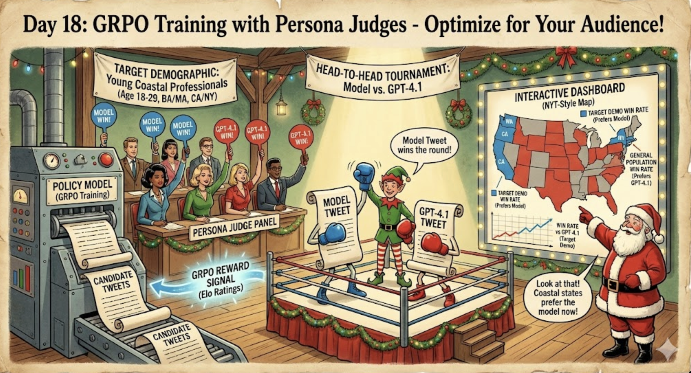

# Day 18: GRPO Training with Persona Judges — Optimize for Your Audience



Train a language model to write content that resonates with a specific demographic audience, using 1 million synthetic personas as judges. Watch your model learn to beat GPT-4.1 with your target audience in real-time.

## Demo

<video src="figs/Day18.mp4" controls width="100%"></video>

## The Idea

What if you could train a model to write content that *specifically* appeals to your target audience?

Building on Day 17's persona simulation, we now use those personas as **judges** in a GRPO (Group Relative Policy Optimization) training loop. The model learns to generate tweets that win head-to-head comparisons against GPT-4.1, as voted by your chosen demographic slice.

The magic: you can optimize for **any audience**:
- Young professionals in coastal cities
- Rural voters over 50
- College-educated women in swing states
- Tech workers who didn't finish college

...and watch the model learn what resonates with them vs. the general population.

## How It Works

```
┌─────────────────────────────────────────────────────────────────┐
│  1. Generate 4 candidate tweets about a fixed subject          │
│  2. Run round-robin tournament: each judge picks their favorite│
│  3. Compute Elo ratings → convert to GRPO advantages           │
│  4. Backprop through policy model                              │
│  5. Evaluate: 8 model tweets vs 8 GPT-4.1 tweets               │
│     - Target demographic votes                                  │
│     - General population votes                                  │
│  6. Visualize on interactive map                               │
└─────────────────────────────────────────────────────────────────┘
```

**Key insight**: By using demographic-filtered personas as judges, we create a reward signal that optimizes for *that specific audience's preferences*, not generic "quality".

## Files

| File | Purpose |
|------|---------|
| `train_grpo_persona_judge.py` | Main training script |
| `config_example.json` | Example configuration |
| `plotter.py` | Generate win rate plots |
| `frontend/` | Interactive visualization dashboard |
| `batch_simulate.py` | Day 17: Run persona simulations |
| `aggregate_results.py` | Day 17: Process simulation results |

## Quick Start

### 1. Start the vLLM Server (for persona judges)

```bash
# Multi-GPU setup for high throughput
vllm serve Qwen/Qwen2.5-7B-Instruct \
    --tensor-parallel-size 4 \
    --pipeline-parallel-size 2 \
    --max-num-seqs 2048 \
    --max-num-batched-tokens 65536 \
    --enable-chunked-prefill \
    --disable-log-requests \
    --port 8000
```

### 2. Configure Your Training Run

Edit `config_example.json`:

```json
{
  "subject": "The future of AI and human work",
  
  "train_judges": {
    "num_personas": 50,
    "filters": {
      "age": {"min": 18, "max": 29},
      "education_level": ["bachelors", "masters"],
      "state": ["CA", "NY"]
    }
  },
  
  "eval": {
    "every_steps": 10,
    "target_num_personas": 1000,
    "general_num_personas": 10000
  }
}
```

**Target demographic filters available:**
- `age`: `{"min": N, "max": M}`
- `education_level`: `["high_school", "some_college", "bachelors", "masters", "doctorate"]`
- `state`: `["CA", "NY", "TX", ...]`
- `sex`: `["Male", "Female"]`

### 3. Run Training

```bash
export OPENAI_API_KEY=sk-...  # For GPT-4.1 baseline comparison
export CUDA_VISIBLE_DEVICES=0,1  # GPUs for policy model

uv run python train_grpo_persona_judge.py --config config_example.json
```

### 4. Watch the Results

**Console output:**
```
============================================================
EVAL STEP 50: Model vs GPT-4.1 (8v8 round-robin)
============================================================
TARGET DEMO:  Model 62.3% win rate
              (623 vs 377, 0 failures)
GENERAL POP:  Model 45.1% win rate
              (4510 vs 5490, 0 failures)
============================================================
```

**Generate plots:**
```bash
uv run python plotter.py --run-dir runs/your_run
```

### 5. Interactive Dashboard

```bash
# Copy results to frontend
cp runs/your_run/eval_results.json frontend/public/grpo_data/
cp runs/your_run/eval_votes.json frontend/public/grpo_data/
cp runs/your_run/persona_sets.json frontend/public/grpo_data/

# Start dashboard
cd frontend && npm install && npm run dev
```

**SSH tunnel for remote clusters:**
```bash
ssh -L 5173:localhost:5173 user@cluster
# Open http://localhost:5173
```

## Dashboard Features

The interactive visualization shows:

- **Step Slider**: Scrub through training to watch the model improve
- **Tweet Display**: See the model's current best tweet
- **Demographic Toggle**: Switch between target demo and general population
- **Political-Style Map**: NYT-style red/blue coloring by state
  - 🔴 Red = prefers GPT-4.1
  - ⚪ Grey = 50/50 split
  - 🔵 Blue = prefers your model
- **Win Rate Chart**: Track progress over training
- **Hover Tooltips**: See exact vote counts per state

## The Science

### Why This Works

Traditional RLHF optimizes for "average human preferences." But audiences aren't monolithic—what resonates with coastal tech workers might fall flat in rural America.

By filtering persona judges to a specific demographic, we create a **targeted reward signal**. The model learns the subtle differences in what makes content appealing to different groups:

- **Word choice**: Formal vs casual, technical vs accessible
- **Framing**: Optimistic vs cautionary, individual vs collective
- **References**: Pop culture, politics, regional concerns
- **Tone**: Earnest vs ironic, passionate vs measured

### Evaluation Design

We compare against GPT-4.1 (a strong baseline) using:
- **8 model tweets** (diverse sampling)
- **8 GPT-4.1 tweets** (diverse sampling)
- **Each persona votes on 1 random matchup** (64 possible pairs)
- **Randomized presentation order** (eliminates position bias)

This gives stable win rate estimates with reasonable API costs.

## Configuration Reference

```json
{
  "subject": "Topic for all tweets",
  "output_dir": "runs/my_experiment",
  "seed": 123,

  "policy": {
    "model_name": "Qwen/Qwen2.5-7B-Instruct",
    "num_train_steps": 1000,
    "learning_rate": 5e-6,
    "candidates_per_step": 4,
    "temperature": 0.9,
    "max_new_tokens": 128,
    "gradient_accumulation_steps": 4,
    "save_every_steps": 50
  },

  "judge": {
    "base_url": "http://localhost:8000/v1",
    "model": "Qwen/Qwen2.5-7B-Instruct",
    "max_concurrent": 128,
    "timeout_s": 120,
    "elo_k": 32.0
  },

  "train_judges": {
    "num_personas": 50,
    "filters": {
      "age": {"min": 18, "max": 29},
      "education_level": ["bachelors", "masters"],
      "state": ["CA", "NY"]
    }
  },

  "eval": {
    "every_steps": 10,
    "target_num_personas": 1000,
    "general_num_personas": 10000
  }
}
```

## Output Structure

```
runs/my_experiment/
├── config.json              # Copy of run configuration
├── persona_sets.json        # Sampled personas with demographics
├── train_log.jsonl          # Detailed per-step training logs
├── training_summary.txt     # Human-readable training progress
├── eval_results.json        # Win rates per eval step
├── eval_votes.json          # Per-persona votes (for dashboard)
└── checkpoint_step_N/       # Model checkpoints
```

## Performance

- **Training**: ~30 sec/step with 50 judges, 4 candidates
- **Eval**: ~60 sec with 1K target + 10K general personas
- **Full run**: 150 steps in ~2 hours on 2x H100

## Example Experiments

### Optimize for Young Coastal Professionals
```json
"filters": {
  "age": {"min": 22, "max": 35},
  "education_level": ["bachelors", "masters"],
  "state": ["CA", "NY", "WA", "MA"]
}
```

### Optimize for Rural America
```json
"filters": {
  "state": ["WY", "MT", "ND", "SD", "NE", "KS", "OK"]
}
```

### Optimize for Non-College Educated
```json
"filters": {
  "education_level": ["high_school", "some_college"]
}
```

## Requirements

- Python 3.10+
- vLLM server running (for persona judges)
- OpenAI API key (for GPT-4.1 baseline)
- 2+ GPUs recommended (1 for policy, vLLM on others)
- Node.js 18+ (for dashboard)

## What's Next

- **Multi-objective optimization**: Balance target appeal vs general appeal
- **Adversarial training**: Minimize backlash from opposing demographics
- **Transfer learning**: Fine-tune on one demographic, test on others
- **Real human eval**: Validate synthetic persona preferences match reality
