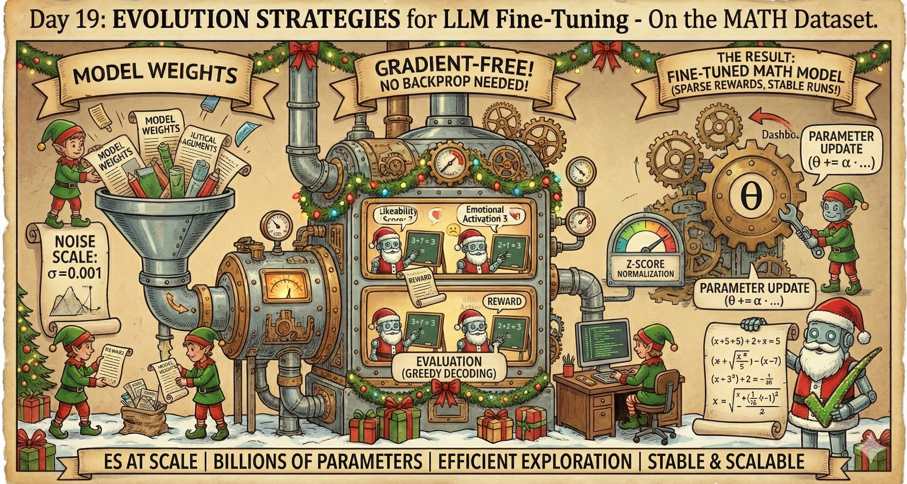
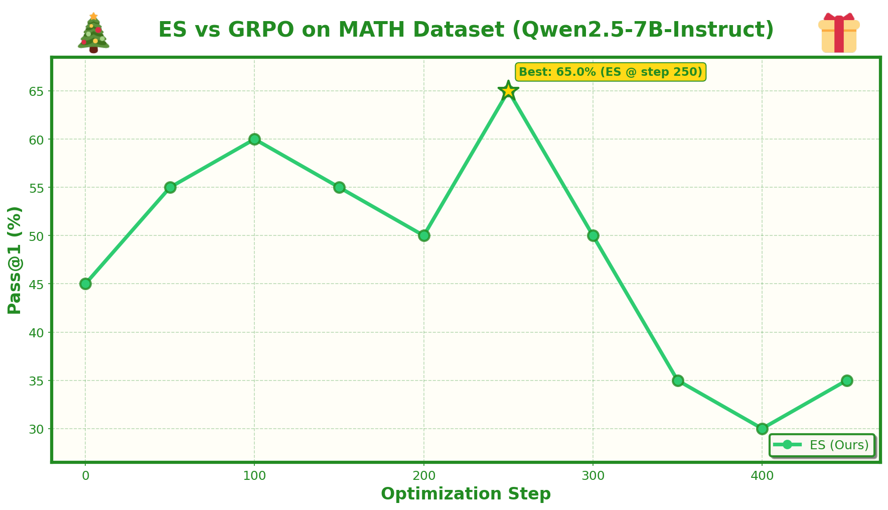

# Day 19: Evolution Strategies for LLM Fine-Tuning



Testing Evolution Strategies (ES) for fine-tuning LLMs on the MATH dataset.

## The Idea

Based on the paper "Evolution Strategies at Scale: LLM Fine-Tuning Beyond Reinforcement Learning", which claims ES can:
- Search efficiently over billions of parameters
- Achieve strong results with just N=30 population size
- Handle sparse/long-horizon rewards well
- Be stable across runs

## How ES Works

| Aspect | ES Approach |
|--------|-------------|
| **Optimization** | Gradient-free |
| **Exploration** | Parameter space (weight perturbations) |
| **Decoding** | Greedy (deterministic) |
| **Memory** | Forward passes only (no backprop needed) |

## The Algorithm

```
For each iteration:
  1. Sample N random seeds
  2. For each seed:
     - Perturb model weights: θ + σ·ε
     - Evaluate with greedy decoding → get reward
     - Restore weights
  3. Z-score normalize rewards
  4. Update: θ += α · (1/N) · Σ z_n · ε_n
```

## Hyperparameters (from paper)

- Population size: N = 30
- Noise scale: σ = 0.001
- Learning rate: α = 5e-4

## Results



## Running

```bash
# Run ES training
./run_es.sh

# Plot results
uv run python plotter.py
```

## Files

- `es_main.py` - Main ES training script
- `run_es.sh` - Run script with paper hyperparameters
- `plotter.py` - Plot ES training results
- `utils.py`, `llms.py`, `math_dataset.py` - Shared utilities
