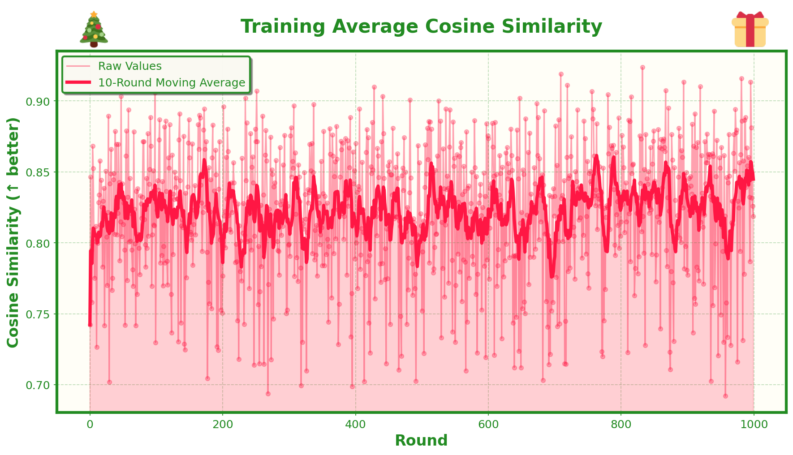
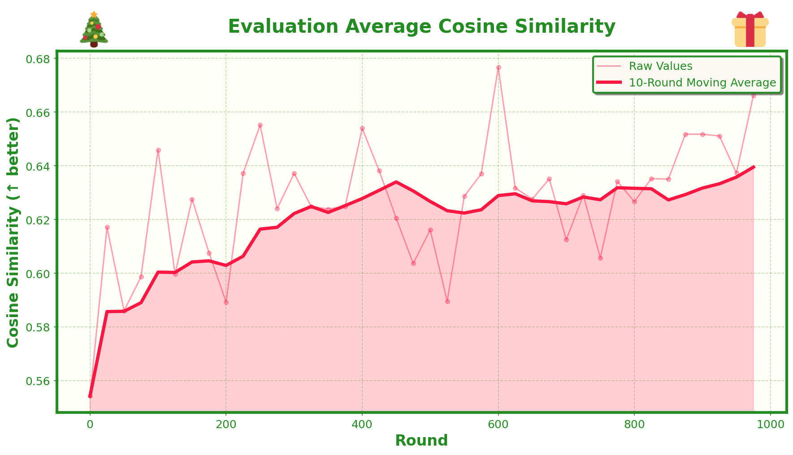
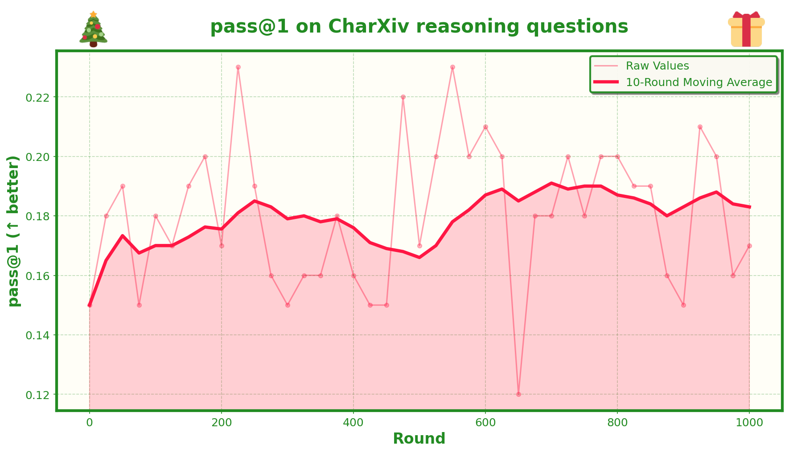

# Day 1: Unsupervised Vision-Language Model Training with GRPO


## What's This About?

Vision-language models are really useful for parsing chart data in Q&A applications. CharXiv is a great benchmark for this, but it requires labeled question-answer pairs for each chart. I wanted to see if we could train a model to reason about plots better without needing all those labels.

The idea came from thinking about CycleGAN - what if we could do something similar with vision-language models? Here's the approach:

1. Take a chart image
2. Prompt a vision-language model to describe it
3. Feed that description to an image generation model (we use Flux Schnell)
4. Use the cosine similarity between the regenerated image and the original as a reward signal for GRPO (Generalized Reward-Powered Optimization)

The thinking is that if the model can recreate the image well, it must be extracting the most important features. And since we're using cosine similarity between DINOv2 embeddings, we're measuring semantic similarity, not just pixel-level matching.

I tested this with Qwen 2.5 3B, and it worked reasonably well. The model improved its cosine similarity scores consistently, and more interestingly, this unsupervised task showed transfer learning to CharXiv reasoning questions - we saw improvements of almost 8% at the peak. Not huge, but promising for a quick experiment with a small model, and the fact that it's completely unsupervised opens up a lot of possibilities.

## Setup

First, get your data ready:

```bash
bash get_data.sh
```

This script will:
- Download CharXiv images from HuggingFace
- Clone the CharXiv repo to get the JSON files and constants
- Run `build_ds.py` to create your train/test splits (75 training images, 25 test images)

You'll end up with:
- `train_images/` - 75 images for training
- `test_images/` - 25 images for evaluation
- `test_data/test_set.json` - Test data with questions and ground truth answers

## API Keys

You'll need a Replicate API key for image generation. Get one at [replicate.com](https://replicate.com) and set it as an environment variable:

```bash
export REPLICATE_API_TOKEN=your_token_here
```

You'll also need an OpenAI API key for evaluation (GPT-4.1 is used as a judge for grading responses):

```bash
export OPENAI_API_KEY=your_key_here
```

## Training

Run the GRPO training:

```bash
uv run python grpo_train.py --output_dir run_1
```

The script has a bunch of arguments you can tweak, but the defaults are reasonable. Key ones:
- `--output_dir`: Where to save everything (default: `run_1`)
- `--num_train_iters`: How many training iterations (default: 1000)
- `--eval_interval`: How often to evaluate (default: 25)
- `--save_iterations`: How often to save checkpoints (default: 25)
- `--num_chains`: Number of completions per image during training (default: 8)

During training, you'll get:
- Training logs in `output_dir/training_logs/`
- Evaluation logs in `output_dir/eval_logs/`
- Checkpoints in `output_dir/ckpts/ckpt-N/`
- For each step: saved images, prompts, and PDFs showing the original image and all generated images sorted by cosine similarity

## Evaluation

After training (or to evaluate the base model), run:

```bash
uv run python eval_checkpoints.py --output_dir run_1
```

This will:
- Evaluate the base model (unfine-tuned)
- Evaluate all saved checkpoints
- Use 10 fixed images from the test set
- Focus on reasoning questions only
- Generate 10 completions per question
- Use GPT-4.1 as a judge to grade responses
- Save results in `output_dir/ckpt_tests/` with detailed JSON files per checkpoint

Each JSON file includes:
- Overall pass@1 (probabilistic pass@1 metric)
- Per-chart results with all completions, scores, and individual pass@1 values

## Plotting

Once you have training and evaluation data, generate the plots:

```bash
uv run python plotter.py
```

This creates three plots in `run_1/plots/`:
1. **Training Average Cosine Similarity** - Shows how the model improves at the proxy task over training
2. **Evaluation Average Cosine Similarity** - Same but on the held-out test set
3. **pass@1 on CharXiv reasoning questions** - Shows transfer learning to the actual task we care about

All plots use the same Christmas-themed styling (because why not?) with moving averages and nice visualizations.

## The Dataset

We're using CharXiv, which contains scientific charts with two types of questions:
- **Descriptive questions**: "What does this chart show?" type questions
- **Reasoning questions**: "What value of X intersects Y?" type questions that require understanding the chart

For training, we only use the images - no questions needed. The model learns by trying to describe images in a way that allows an image generation model to recreate them.

For evaluation, we use the reasoning questions from the test set to measure transfer learning. The idea is that if the model learned to extract salient features (to recreate images), it should also be better at answering questions about those features.

## How It Works

The training loop is pretty straightforward:

1. For each training image, generate multiple descriptions (using the current model)
2. For each description, generate an image using Flux Schnell
3. Compute DINOv2 embeddings for both the original and generated images
4. Calculate cosine similarity as the reward
5. Use GRPO to update the model - higher cosine similarity = higher reward = model learns to generate better descriptions

The loss is just the advantage-weighted policy gradient (no KL penalty, no base model). Simple and effective.

Evaluation works similarly, but we also test on the actual CharXiv reasoning questions to see if the learned representations transfer to the downstream task.

## Results

With Qwen 2.5 3B, we saw:
- Consistent improvement in cosine similarity (the proxy task)
- Transfer learning to CharXiv reasoning questions (up to ~8% improvement in pass@1)
- All of this without any labeled Q/A pairs during training

Not groundbreaking, but it's a proof of concept that unsupervised learning on vision-language models can work, and it opens the door to exploring more CycleGAN-esque or autoencoder-style approaches where we don't need labeled data.

### Training Cosine Similarity



### Evaluation Cosine Similarity



### Pass@1 on CharXiv Reasoning Questions



