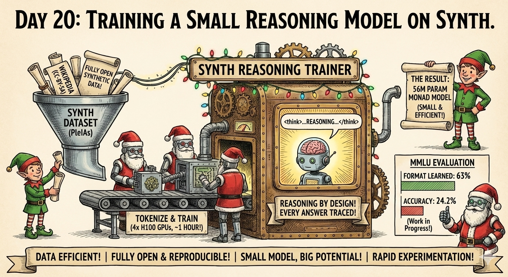
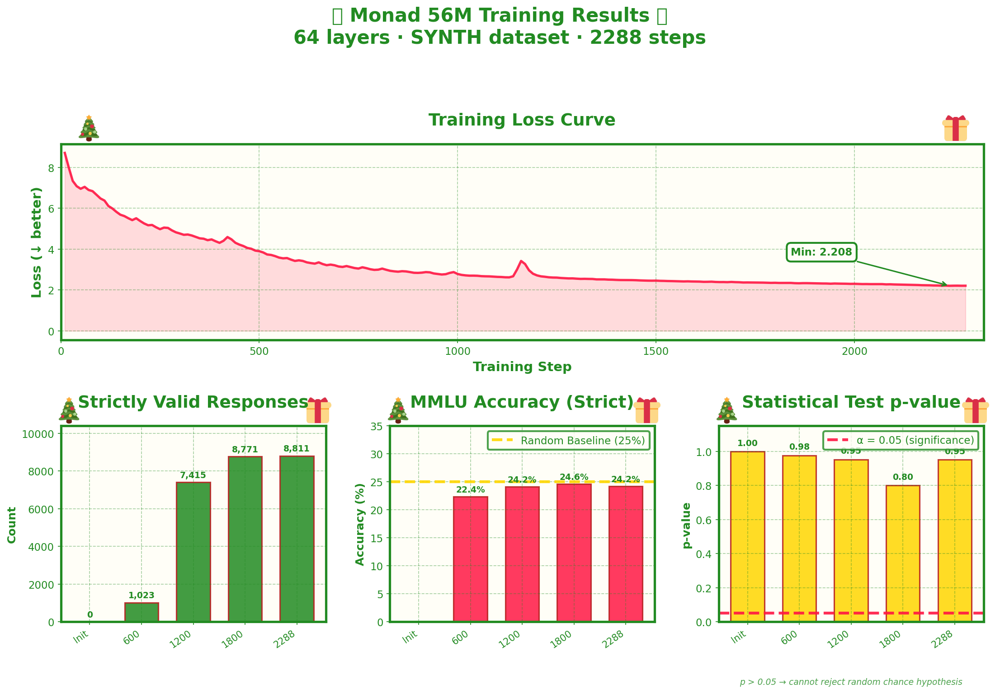

# Day 20: Training a Small Reasoning Model on SYNTH



Training a 56M parameter reasoning model from scratch on PleIAs's incredible [SYNTH dataset](https://huggingface.co/datasets/PleIAs/SYNTH)—the first fully open synthetic dataset designed specifically for small reasoning models.

## The Idea

PleIAs and the AI Alliance just released something remarkable: **SYNTH**, a 68 million sample synthetic dataset that represents a new paradigm for training small language models. What makes it special:

- **Fully Open**: Built on Wikipedia (CC-BY-SA) and generated with models that allow output reuse—no licensing headaches
- **Reasoning by Design**: Every answer includes intermediate reasoning traces with `<think>...</think>` syntax
- **Data Efficient**: Best results achieved with just 100-200B tokens trained
- **State of the Art**: Their [Monad](https://huggingface.co/PleIAs/Monad) (56M params) achieves impressive MMLU scores for its size class

This is the kind of research direction I want to explore much more deeply, so I wanted to cap off these 25 days of advent experiments with some preliminary work here—recreating their training pipeline and establishing a baseline for future experiments.

## What We Built

A minimal but complete pipeline for training small reasoning models:

1. **Download**: Stream the 68M samples from HuggingFace
2. **Tokenize**: Filter to English, format with ChatML + thinking tokens, pre-tokenize everything
3. **Train**: 4x H100 distributed training with torch.compile
4. **Evaluate**: MMLU evaluation looking for structured `</think>` reasoning

### Training Details

| Setting | Value |
|---------|-------|
| Model | Monad architecture (56M params, 64 layers) |
| Dataset | ~2.3M English samples from SYNTH |
| Tokens | ~3 billion tokens |
| Hardware | 4x H100 GPUs |
| Training Time | **~1 hour** |
| Batch Size | 64 per GPU × 4 accumulation × 4 GPUs = 1024 effective |
| Sequence Length | 1280 tokens |
| Learning Rate | 4e-3 with warmup-stable-decay schedule |

The key to fast training: **pre-tokenizing everything**. We process all 2.3M samples upfront into Arrow format, so the training loop just loads tensors—no tokenization overhead during training.

## Files

| File | Purpose |
|------|---------|
| `1_download.py` | Download SYNTH dataset from HuggingFace |
| `2_tokenize.py` | Filter, format, and pre-tokenize all samples |
| `3_train.py` | Distributed training with HuggingFace Trainer |
| `4_eval_checkpoints.py` | Evaluate checkpoints on MMLU with live weight updates |
| `eval_mmlu_vllm.py` | Standalone MMLU evaluation using vLLM server |
| `plot_results.py` | Generate training loss and MMLU plots |

## Quick Start

### 1. Download & Tokenize

```bash
# Download (~68M samples, takes a while)
python 1_download.py

# Filter to English + tokenize (~2.3M samples)
python 2_tokenize.py
```

This creates:
- `raw_synth/` - Raw dataset in Arrow format
- `tokenized_synth/` - Pre-tokenized train/eval splits + tokenizer

### 2. Train

```bash
# 4 GPU training (~1 hour)
accelerate launch --num_processes 4 3_train.py

# Single GPU (slower, but works)
python 3_train.py
```

Checkpoints saved to `results/monad_YYYY-MM-DD_HH-MM-SS/`

### 3. Evaluate

```bash
# Start vLLM server
vllm serve results/monad_*/model.safetensors --port 8000

# Run MMLU eval (all 57 subjects)
python eval_mmlu_vllm.py \
    --model results/monad_* \
    --api_url http://localhost:8000 \
    --all_subjects \
    --output results/mmlu_eval.json
```

## Format Details

The training data is formatted with ChatML and explicit thinking tokens:

```
<|im_start|>user
{query}<|im_end|>
<|im_start|>assistant
<think>
{reasoning}
</think>

{answer}<|im_end|>
```

This trains the model to:
1. See a query
2. Generate reasoning inside `<think>...</think>`
3. Produce the final answer after closing the think block

## MMLU Evaluation

For evaluation, we prompt the model and look for the `</think>` token to know when reasoning is complete, then extract the answer letter (A/B/C/D) from what follows.

### Current Results

| Metric | Value |
|--------|-------|
| Total Questions | 14,042 |
| Strictly Valid (has `</think>`) | 8,811 (62.7%) |
| Accuracy (strict) | 24.2% |
| Random Baseline | 25.0% |
| p-value | 0.95 |

**Interpretation**: The model isn't statistically better than random guessing yet. But that's okay for a first experiment! The important wins:

1. ✅ **Format learned**: 63% of responses have the correct `<think>...</think>` structure
2. ✅ **Pipeline works**: Download → tokenize → train → eval, all functional
3. ✅ **Fast iteration**: Full training run in ~1 hour enables rapid experimentation

### What's Next

There are probably better ways to do the eval—right now we're just looking for `</think>` and matching the next letter. Future experiments could:

- Train longer (more tokens/epochs)
- Tune hyperparameters (LR, batch size, warmup)
- Better evaluation prompting
- Curriculum learning (start with easier samples)
- Mix in more data sources

This is just the beginning of exploring synthetic data for small reasoning models.

## Results Visualization

After training, generate plots:

```bash
python plot_results.py
```



## Requirements

- Python 3.10+
- PyTorch 2.0+ with CUDA
- 4x H100 GPUs (or adjust batch size for smaller setups)
- ~100GB disk space for dataset + checkpoints

```bash
pip install torch transformers accelerate datasets vllm scipy tqdm
```

## Dataset

Uses [PleIAs/SYNTH](https://huggingface.co/datasets/PleIAs/SYNTH):
- 68M synthetic samples derived from 50K Wikipedia articles
- 8 languages (we filter to English for this experiment)
- Exercises: reasoning, writing, retrieval, arithmetic
- All samples include reasoning traces

## Links

- **Dataset**: [PleIAs/SYNTH](https://huggingface.co/datasets/PleIAs/SYNTH) (68M samples, CC-BY-SA)
- **Model**: [PleIAs/Monad](https://huggingface.co/PleIAs/Monad) (56M params, state-of-the-art for size)
- **Larger Model**: [PleIAs/Baguettotron](https://huggingface.co/PleIAs/Baguettotron) (300M params)
- **Blog**: [SYNTH Announcement](https://huggingface.co/datasets/PleIAs/SYNTH#synth)

## Why This Matters

Small reasoning models trained on synthetic data represent a fascinating frontier:

1. **Reproducibility**: Fully open data + models = anyone can replicate
2. **Efficiency**: 56M params fits on consumer hardware
3. **Data Quality**: Synthetic reasoning traces may be cleaner than scraped web text
4. **Sovereignty**: No licensing issues, train your own models freely

Looking forward to diving deeper into this space in future experiments! 🎄

