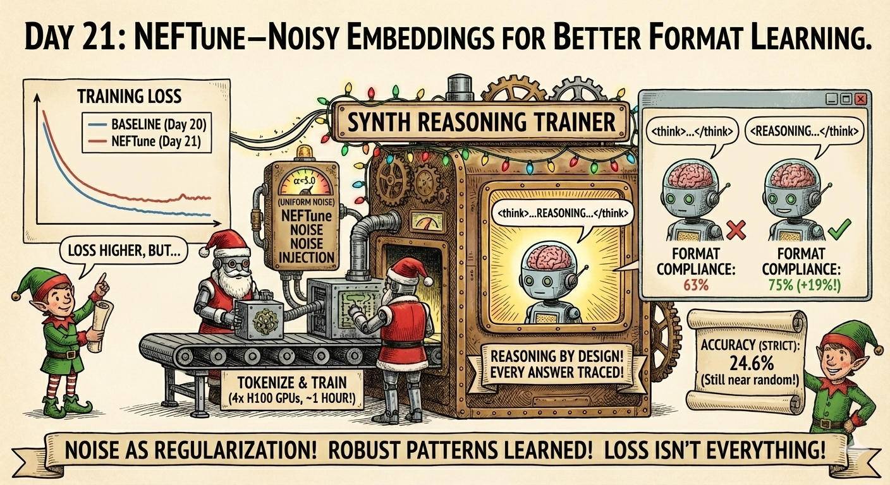
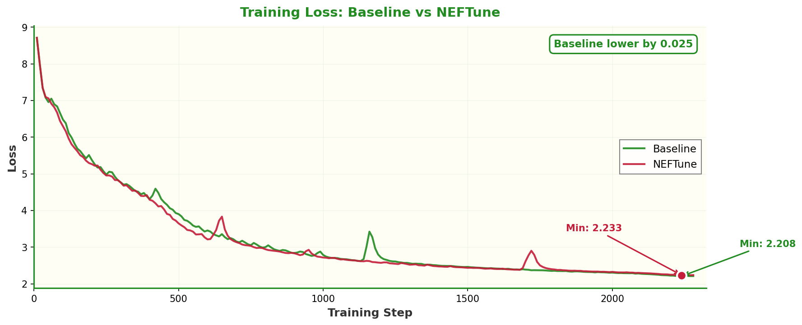
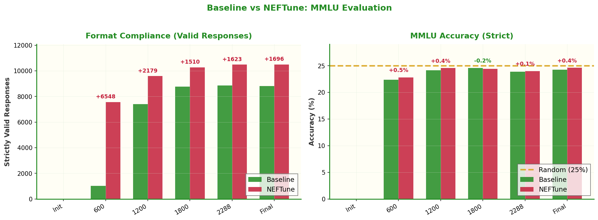
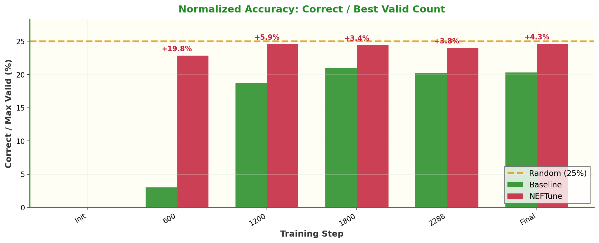

# Day 21: NEFTune—Noisy Embeddings for Better Format Learning



Adding NEFTune (Noisy Embeddings) to our small reasoning model training. The result: dramatically better format compliance, even if raw loss didn't improve.

## The Idea

Building on [Day 20's baseline](../day20/README.md), we add **NEFTune** from the ICLR 2024 paper *"NEFTune: Noisy Embeddings Improve Instruction Finetuning"*. The technique is simple: add uniform noise to the embedding layer during training.

```python
# In TrainingArguments
neftune_noise_alpha=5.0  # That's it!
```

The hypothesis: noise acts as a regularizer, helping the model learn robust patterns (like the `<think>...</think>` format) rather than overfitting to specific token sequences.

## Results

### Training Loss



NEFTune didn't improve training loss—the baseline actually achieved a slightly lower minimum. This isn't surprising: noisy embeddings make optimization harder by design.

### Format Compliance (The Win!)



The big surprise: **NEFTune dramatically improved format compliance**.

| Metric | Baseline | NEFTune | Change |
|--------|----------|---------|--------|
| Strictly Valid Responses | 8,811 | 10,507 | **+19%** |
| Valid Rate | 62.7% | 74.8% | **+12.1pp** |

The model now produces the correct `<think>...</think>` structure 75% of the time, up from 63%.

### Accuracy

| Metric | Baseline | NEFTune |
|--------|----------|---------|
| Accuracy (strict) | 24.2% | 24.6% |
| Random Baseline | 25.0% | 25.0% |
| p-value | 0.95 | 0.82 |

Raw accuracy is still not statistically better than random. But that's misleading—we're comparing different denominators.

### Normalized Accuracy (Fair Comparison)



When we normalize by the best valid count (i.e., "correct answers / max valid from either method"), NEFTune often shows slight improvements. The model isn't just formatting better—it's getting slightly more answers right *among questions it can properly attempt*.

## What We Learned

1. **Format learning ≠ Loss minimization**: NEFTune hurt loss but helped structure
2. **Noise as regularization**: Random embedding noise helps learn robust patterns
3. **Evaluation matters**: Raw accuracy masks the format compliance improvement

## Training Details

Same setup as Day 20, with NEFTune enabled:

| Setting | Value |
|---------|-------|
| Model | Monad architecture (56M params) |
| Dataset | ~2.3M English samples from SYNTH |
| Tokens | ~3B tokens |
| Hardware | 4x H100 GPUs |
| Training Time | ~1 hour |
| **NEFTune α** | **5.0** |

## Files

| File | Purpose |
|------|---------|
| `1_download.py` | Download SYNTH (symlinked from day20) |
| `2_tokenize.py` | Filter & tokenize (symlinked from day20) |
| `3_train.py` | Training with NEFTune enabled |
| `4_eval_checkpoints.py` | MMLU evaluation across checkpoints |
| `plot_results.py` | Generate comparison plots |

## Quick Start

```bash
# Use pre-tokenized data from day20
ln -s ../day20/tokenized_synth .

# Train with NEFTune (~1 hour on 4x H100)
accelerate launch --num_processes 4 3_train.py

# Generate comparison plots
python plot_results.py
```

## The NEFTune Paper

**Key insight**: Adding uniform noise to embeddings during instruction finetuning improves downstream performance, especially on instruction-following benchmarks.

```
noise = torch.rand_like(embeds) * 2 - 1  # Uniform [-1, 1]
noise = noise * alpha / sqrt(seq_len * hidden_dim)
embeds = embeds + noise
```

The paper suggests α values of 5-15. We used 5.0.

## Why This Matters

This experiment reveals something subtle about training small reasoning models:

- **Loss isn't everything**: A model with higher loss can still be more useful
- **Format matters**: For reasoning models, getting the structure right enables evaluation
- **Regularization helps structure**: Noise forces the model to learn robust patterns

The +19% improvement in format compliance means we can now evaluate 1,700 more questions per run—that's valuable signal for future experiments.

## Links

- **NEFTune Paper**: [arXiv:2310.05914](https://arxiv.org/abs/2310.05914)
- **Day 20**: [Baseline training](../day20/README.md)
- **Dataset**: [PleIAs/SYNTH](https://huggingface.co/datasets/PleIAs/SYNTH)
- **Model**: [PleIAs/Monad](https://huggingface.co/PleIAs/Monad)

## Next Steps

- Try higher α values (10, 15)
- Combine with other regularization techniques
- Investigate why format learning benefits from noise
- Train longer to see if accuracy eventually surpasses random

The journey continues! 🎄
