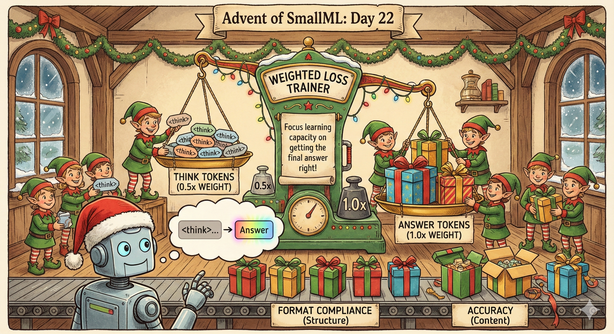
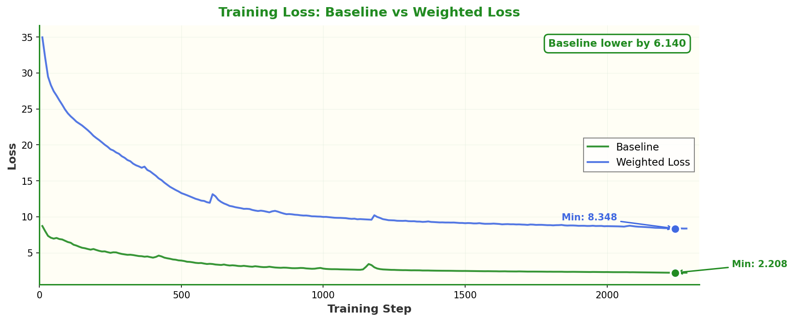
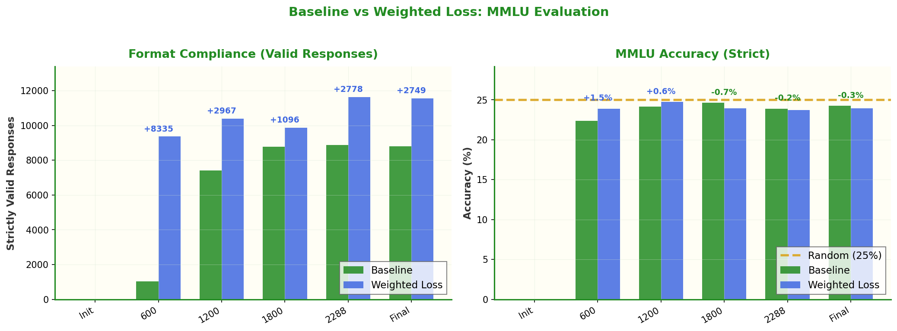
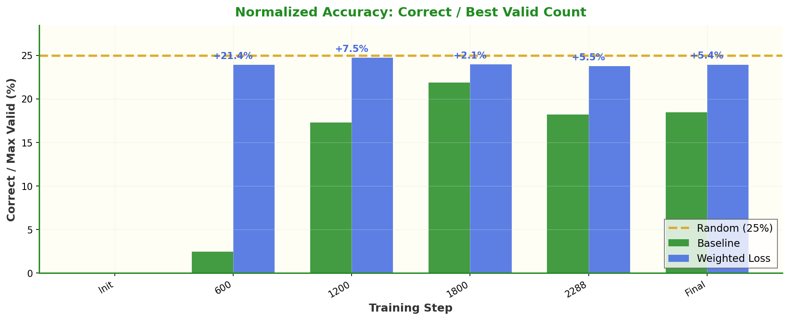

# Day 22: Weighted Loss—Prioritizing Answers Over Reasoning



What if we weight the `<think>` tokens less than the answer tokens during training? The hypothesis: focus the model's learning capacity on getting the final answer right, while still learning the reasoning format.

## The Idea

Building on [Day 20's baseline](../day20/README.md), we implement **weighted loss** where tokens inside `<think>...</think>` blocks are weighted at 0.5× compared to answer tokens.

```python
class WeightedLossTrainer(Trainer):
    def __init__(self, ..., think_weight=0.5):
        self.think_weight = think_weight
    
    def compute_loss(self, model, inputs, ...):
        # Weight <think>...</think> tokens at 0.5x
        weights = self._compute_weights(inputs["input_ids"])
        loss = cross_entropy(..., reduction='none')
        weighted_loss = loss * weights
        return weighted_loss.sum() / weights.sum()
```

The intuition: reasoning traces are useful scaffolding, but the final answer is what matters for evaluation. Maybe we should allocate more learning capacity to getting answers right.

## Results

### Training Loss



Note: The weighted loss numbers aren't directly comparable to baseline since we're computing a different weighted average. What matters is downstream performance.

### Format Compliance (The Big Win!)



Weighted loss achieved the **best format compliance yet**:

| Metric | Baseline | NEFTune (Day 21) | Weighted Loss | Change vs Baseline |
|--------|----------|------------------|---------------|-------------------|
| Strictly Valid | 8,811 | 10,507 | **11,560** | **+31%** |
| Valid Rate | 62.7% | 74.8% | **82.3%** | **+19.6pp** |

The model now produces correct `<think>...</think>` structure 82% of the time!

### Accuracy

| Metric | Baseline | Weighted Loss |
|--------|----------|---------------|
| Accuracy (strict) | 24.2% | 23.9% |
| Random Baseline | 25.0% | 25.0% |

Accuracy is slightly lower than baseline. The model formats better but isn't more accurate per valid response.

### Normalized Accuracy



When normalizing by valid count, we see the weighted loss model gets more total correct answers simply because it can attempt more questions with valid formatting.

## What We Learned

1. **Weighting helps format learning**: Reducing emphasis on reasoning tokens improved structure compliance dramatically
2. **Format vs accuracy trade-off**: Better formatting didn't translate to better per-question accuracy
3. **More valid = more signal**: 11,560 valid responses vs 8,811 means 31% more evaluation signal

## Training Details

Same setup as Day 20, with weighted loss:

| Setting | Value |
|---------|-------|
| Model | Monad architecture (56M params) |
| Dataset | ~2.3M English samples from SYNTH |
| Tokens | ~3B tokens |
| Hardware | 4x H100 GPUs |
| Training Time | ~1 hour |
| **Think Weight** | **0.5** |

## Files

| File | Purpose |
|------|---------|
| `2_tokenize.py` | Tokenization (uses day20 raw data) |
| `3_train.py` | Training with WeightedLossTrainer |
| `submit_eval_jobs.sh` | Submit MMLU eval jobs to SLURM |
| `plot_results.py` | Generate comparison plots |

## Quick Start

```bash
# Use raw data from day20, re-tokenize
ln -s ../day20/raw_synth .
python 2_tokenize.py

# Train with weighted loss (~1 hour on 4x H100)
accelerate launch --num_processes 4 3_train.py

# Submit eval jobs
./submit_eval_jobs.sh results/monad_*

# Generate comparison plots (after evals complete)
python plot_results.py
```

## The WeightedLossTrainer

Key implementation details:

```python
def _compute_weights(self, input_ids):
    """Find <think>...</think> spans and weight them at 0.5x"""
    weights = torch.ones_like(input_ids, dtype=torch.float32)
    
    for b in range(batch_size):
        in_think = False
        for i in range(seq_len):
            if ids[i:i+len(start)] == "<think>":
                in_think = True
            if in_think:
                weights[b, i] = 0.5
            if ids[i:i+len(end)] == "</think>":
                in_think = False
    
    return weights
```

The weights are computed on-the-fly during training, so no changes to the dataset are needed.

## Comparison: Day 20 → 21 → 22

| Day | Method | Valid Responses | Valid Rate | Accuracy |
|-----|--------|-----------------|------------|----------|
| 20 | Baseline | 8,811 | 62.7% | 24.2% |
| 21 | NEFTune | 10,507 | 74.8% | 24.6% |
| **22** | **Weighted Loss** | **11,560** | **82.3%** | 23.9% |

Both regularization approaches (NEFTune noise, weighted loss) dramatically improve format compliance. Weighted loss achieves the best formatting but slightly lower accuracy.

## Why This Matters

This experiment suggests that **how we weight different parts of the training data matters**:

- The model can learn format very well when we don't over-emphasize reasoning tokens
- But accuracy might suffer if we under-train on reasoning
- Future work: try different weight ratios (0.3, 0.7) or weight schedules

## Links

- **Day 20**: [Baseline training](../day20/README.md)
- **Day 21**: [NEFTune experiment](../day21/README.md)
- **Dataset**: [PleIAs/SYNTH](https://huggingface.co/datasets/PleIAs/SYNTH)
- **Model**: [PleIAs/Monad](https://huggingface.co/PleIAs/Monad)

## Next Steps

- Try different think_weight values (0.3, 0.7, 0.1)
- Combine weighted loss with NEFTune
- Weight schedule: start at 1.0, decay to 0.5
- Curriculum: weight answers more as training progresses

The format compliance keeps improving! 🎄
