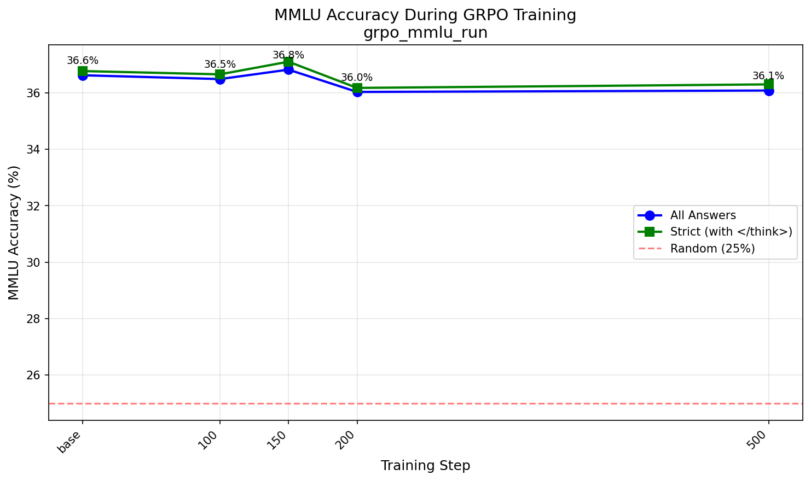
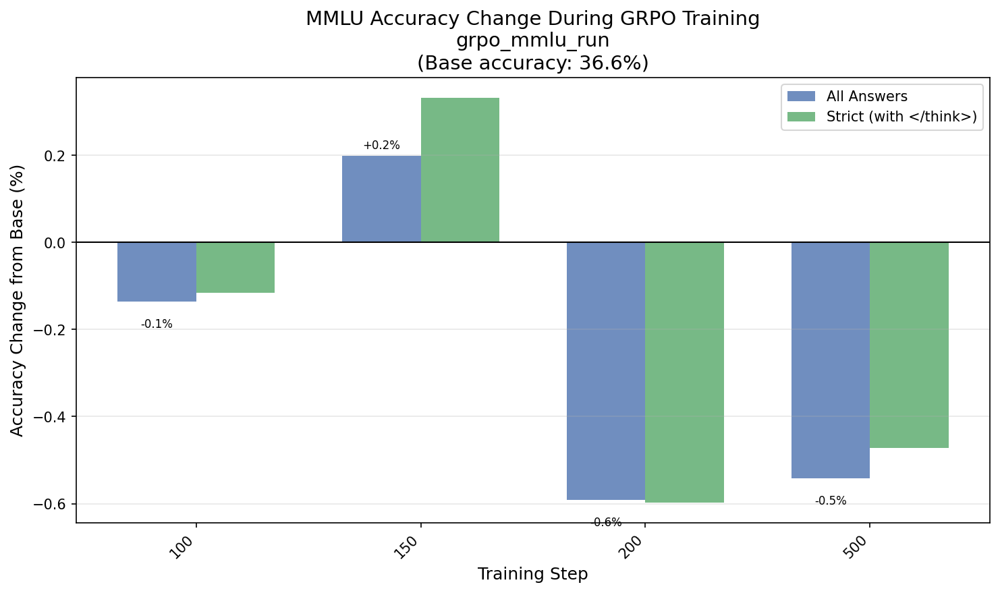

# Day 24: GRPO with LLM-as-Judge on MMLU

## The Problem

Can we improve a model's reasoning ability **without any ground truth labels**?

Traditional RLHF and GRPO approaches for math/reasoning tasks rely on verifiable rewards - you check if the model got the right answer, and use that as the reward signal. But this requires:
1. Problems with clear correct answers
2. A reliable way to extract and verify those answers
3. Often, expensive human annotation or carefully curated datasets

What if we could improve reasoning using only **preference comparisons**? The idea: generate multiple reasoning chains for the same problem, have an LLM judge which reasoning is "better", and use that preference signal to train.

## The Approach

We use [Baguettotron](https://huggingface.co/PleIAs/Baguettotron), a 7B model trained by PleIAs that uses a `<think>...</think>` format for chain-of-thought reasoning. The model first thinks through the problem, then gives its answer.

For each training step:
1. **Sample a random MMLU question** (from all 57 subjects)
2. **Generate 4 different completions** from the model
3. **Round-robin pairwise comparison**: GPT-4.1 judges all 6 pairs, asking "which answer demonstrates better reasoning?"
4. **Win rate = reward**: Each completion's reward is how many of its 3 matchups it won (0 to 1)
5. **GRPO update**: Use normalized rewards as advantages for policy gradient

The key insight: we never tell the model which answer is *correct* - only which *reasoning process* GPT-4.1 prefers. Can preference over reasoning style translate to actual accuracy improvements?

## Results

Unfortunately, the experiment didn't show significant improvements. The best checkpoint (step 150) achieved only a **+0.2%** boost over the base model:

| Step | Accuracy | Diff from Base |
|------|----------|----------------|
| base | 36.63% | --- |
| 100 | 36.49% | -0.14% |
| 150 | 36.83% | **+0.20%** |
| 200 | 36.03% | -0.59% |
| 500 | 36.08% | -0.54% |
| final | 36.74% | +0.11% |

That said, it's interesting that we got *any* improvement just from ranking reasoning quality, without any ground truth signal. The reward was purely "which of these 4 completions has better reasoning according to GPT-4.1?" - no correctness checking at all. 

The fact that it moved the needle at all (even if within noise) suggests this approach could be worth exploring further with:
- More training steps
- Better judge prompts (maybe asking about logical coherence, step validity, etc.)
- Combining with weak correctness signals
- Different base models





## How it works

1. **Sample MMLU question** - randomly pick from all 57 subjects
2. **Generate 4 completions** - using Baguettotron with `<think>` reasoning
3. **Round-robin comparison** - GPT-4.1 judges all 6 pairs (4 choose 2)
4. **Win rate = reward** - each completion's reward is its win rate (0-1)
5. **GRPO update** - use advantages from normalized rewards

## Files

- `main.py` - Main training script
- `openai_judge.py` - Async GPT-4.1 pairwise comparison
- `eval_mmlu.py` - MMLU evaluation for HuggingFace models
- `submit_eval_jobs.sh` - Submit sbatch jobs to evaluate all checkpoints
- `plot_results.py` - Generate plots from eval results
- `llms.py` - Model loading utilities
- `utils.py` - Prompt formatting and GRPO utilities
- `vllm_client.py` / `vllm_server.py` - vLLM integration for fast inference

## Usage

### Training

```bash
# Set OpenAI API key
export OPENAI_API_KEY="your-key-here"

# Run training (500 steps, saves every 50)
./run.sh

# Or with custom options
python main.py \
    --model_name "PleIAs/Baguettotron" \
    --num_train_iters 500 \
    --num_chains 4 \
    --save_every 50 \
    --use_liger
```

### Evaluate Checkpoints

```bash
# Submit sbatch jobs to evaluate all checkpoints (8 subjects, ~5min each)
./submit_eval_jobs.sh grpo_mmlu_run

# Full eval on all 57 subjects (~30min each)
./submit_eval_jobs.sh grpo_mmlu_run --all
```

### Plot Results

```bash
# After eval jobs complete, generate plots
python plot_results.py grpo_mmlu_run
```

## Output

- `grpo_mmlu_run/checkpoint_step_N/` - Model checkpoints
- `grpo_mmlu_run/run_log.json` - Training log with all generations
- `grpo_mmlu_run/mmlu_eval/step_*.json` - MMLU eval results per checkpoint
- `grpo_mmlu_run/figs/` - Generated plots
