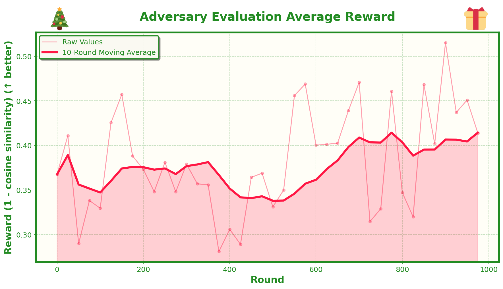
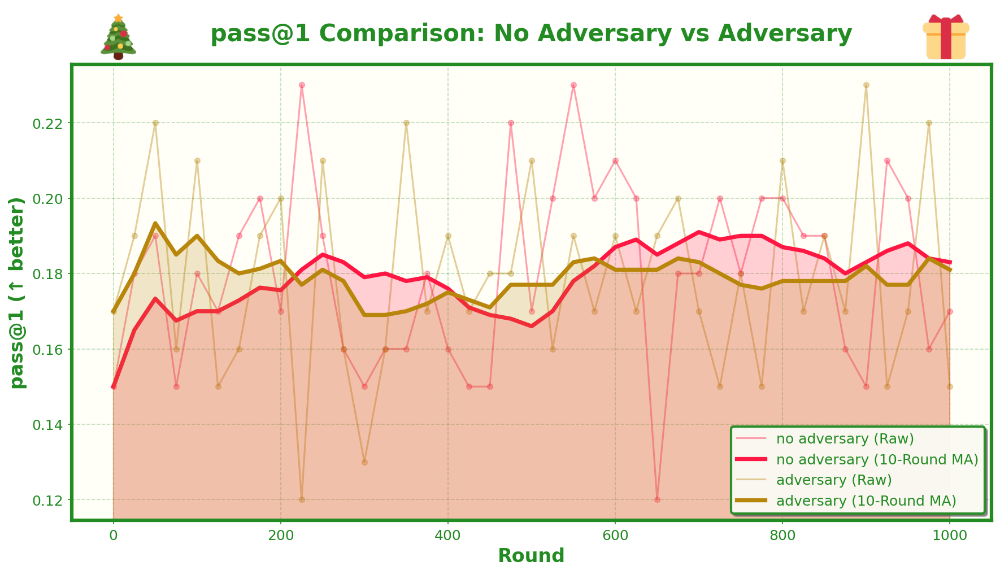
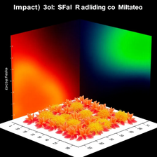
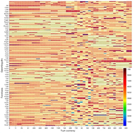
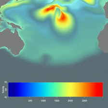
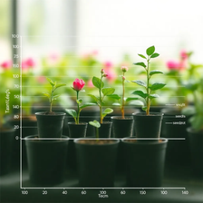

# Day 3: Adversarial Unsupervised Vision-Language Model Training with GRPO


## What's This About?

This is an adversarial extension of the unsupervised training approach from Day 2. The core idea is similar - train a vision-language model to describe images well enough that an image generation model can recreate them, using cosine similarity as a reward signal. But now we add an **adversary model** that actively tries to find the base model's weaknesses.

## The Adversarial Setup

The training alternates between two models:

### Base Model (Vision-Language Model)
- **Goal**: Describe images accurately so they can be recreated
- **Reward**: High cosine similarity between original and regenerated image
- **Training**: Takes an image → describes it → image generation model recreates it → rewarded for high similarity

### Adversary Model (Text-Only Model)
- **Goal**: Generate prompts that create images the base model struggles with
- **Reward**: Low cosine similarity (1 - cosine similarity) - it's rewarded for making the base model fail
- **Training**: Generates a prompt → image generation model creates an image from that prompt → base model describes it → image generation model recreates from description → adversary rewarded for low similarity

The key insight is that by having the adversary actively search for challenging images, it might discover systematic weaknesses in the base model that we wouldn't find through random sampling. The adversary learns to exploit these weaknesses, which in theory should force the base model to become more robust.

## How It Works

The training loop alternates between base and adversary:

1. **Base Model Training Round**:
   - Adversary generates a prompt (in eval mode)
   - Image generation model creates an image from that prompt
   - Base model describes the image
   - Image generation model recreates from the description
   - Base model rewarded for high cosine similarity

2. **Adversary Model Training Round**:
   - Adversary generates multiple prompts
   - For each prompt: generate image → base model describes → recreate → compute similarity
   - Adversary rewarded for low cosine similarity (1 - similarity)
   - Adversary learns to generate prompts that create challenging images

The models train alternately, creating a competitive dynamic where the adversary finds weaknesses and the base model must adapt to handle them.

## Setup

First, get your data ready:

```bash
bash get_data.sh
```

This script will:
- Download CharXiv images from HuggingFace
- Clone the CharXiv repo to get the JSON files and constants
- Run `build_ds.py` to create your train/test splits (75 training images, 25 test images)

You'll end up with:
- `train_images/` - 75 images for training
- `test_images/` - 25 images for evaluation
- `test_data/test_set.json` - Test data with questions and ground truth answers

## API Keys

You'll need a Replicate API key for image generation. Get one at [replicate.com](https://replicate.com) and set it as an environment variable:

```bash
export REPLICATE_API_TOKEN=your_token_here
```

You'll also need an OpenAI API key for evaluation (GPT-4.1 is used as a judge for grading responses):

```bash
export OPENAI_API_KEY=your_key_here
```

## Training

Run the GRPO training:

```bash
uv run python grpo_train.py --output_dir run_1
```

The script has a bunch of arguments you can tweak, but the defaults are reasonable. Key ones:
- `--output_dir`: Where to save everything (default: `run_1`)
- `--num_train_iters`: How many training iterations (default: 1000)
- `--eval_interval`: How often to evaluate (default: 25)
- `--save_iterations`: How often to save checkpoints (default: 25)
- `--num_chains`: Number of completions per image during training (default: 8)

During training, you'll get:
- Training logs in `output_dir/training_logs/`
- Evaluation logs in `output_dir/eval_logs/`
- Checkpoints in `output_dir/ckpts/ckpt-N/`
- For each step: saved images, prompts, and PDFs showing the original image and all generated images sorted by cosine similarity

## Evaluation

After training (or to evaluate the base model), run:

```bash
uv run python eval_checkpoints.py --output_dir run_1
```

This will:
- Evaluate the base model (unfine-tuned)
- Evaluate all saved checkpoints
- Use 10 fixed images from the test set
- Focus on reasoning questions only
- Generate 10 completions per question
- Use GPT-4.1 as a judge to grade responses
- Save results in `output_dir/ckpt_tests/` with detailed JSON files per checkpoint

Each JSON file includes:
- Overall pass@1 (probabilistic pass@1 metric)
- Per-chart results with all completions, scores, and individual pass@1 values

## Plotting

Once you have training and evaluation data, generate the plots:

```bash
uv run python plotter.py --output-dir adv_run_1
```

This creates several plots in `adv_run_1/plots/`:
1. **Base Model Training Average Cosine Similarity** - Shows how the base model improves at the proxy task
2. **Base Model Evaluation Average Cosine Similarity** - Same but on the held-out test set
3. **Adversary Training Average Cosine Similarity** - How well the base model recreates adversary-generated images
4. **Adversary Training Average Reward** - How successful the adversary is (higher = base model struggles more)
5. **Adversary Evaluation metrics** - Same metrics but on eval set
6. **pass@1 on CharXiv reasoning questions** - Shows transfer learning to the actual task
7. **pass@1 Comparison** - Side-by-side comparison with Day 2 (no adversary) baseline

All plots use the same Christmas-themed styling (because why not?) with moving averages and nice visualizations.

## The Dataset

We're using CharXiv, which contains scientific charts with two types of questions:
- **Descriptive questions**: "What does this chart show?" type questions
- **Reasoning questions**: "What value of X intersects Y?" type questions that require understanding the chart

For training, we only use the images - no questions needed. The model learns by trying to describe images in a way that allows an image generation model to recreate them.

For evaluation, we use the reasoning questions from the test set to measure transfer learning. The idea is that if the model learned to extract salient features (to recreate images), it should also be better at answering questions about those features.

## Technical Details

The training uses GRPO (Generalized Reward-Powered Optimization) with:
- **Base model reward**: Cosine similarity between original and regenerated image (using DINOv2 embeddings)
- **Adversary reward**: 1 - cosine similarity (wants to minimize base model's performance)
- **Loss**: Advantage-weighted policy gradient (no KL penalty)
- **Training schedule**: Strict alternation - even rounds train base, odd rounds train adversary

Both models start from the same checkpoint (Qwen 2.5 3B), but the adversary is text-only (no vision encoder) since it only generates prompts.

Evaluation works similarly to Day 2 - we test on CharXiv reasoning questions to measure transfer learning. The hope is that by training on adversarially-chosen challenging images, the base model becomes more robust and generalizes better.

## Results

The adversarial setup adds an interesting dynamic where the adversary learns to generate prompts that create challenging images, forcing the base model to adapt and become more robust.

### Adversary Reward Curve

Here's the reward curve during training, showing how the adversary improves at finding challenging images for the base model:



### Performance Comparison: Adversarial vs Non-Adversarial Training

Comparing the base model's performance against the non-adversarial training from Day 2:



Interestingly, the adversarial training shows better performance initially, but eventually converges to similar levels as the non-adversarial approach. This might be worth exploring further - perhaps longer training, different adversary schedules, or stronger adversary models could maintain the advantage. The fact that it starts better suggests the adversarial setup does find useful training signal, but the benefit seems to plateau.

### Examples of Adversary-Generated Images

The adversary learned to generate some interesting and challenging images. Here are good examples of what it learned to create:







### Degenerate Cases

However, the adversary also learned some degenerate strategies. For example, it often started adding plants or foliage in the background as a way to confuse the base model:



This is a common issue in adversarial training - the adversary finds exploits rather than genuinely challenging examples. Future work could explore ways to constrain the adversary to avoid these degenerate solutions while still finding hard cases.

## Comparison with Day 2

This is very similar to Day 2, except:
- **Day 2**: Base model trains on random images from the dataset
- **Day 3**: Base model trains on images generated from adversary prompts (which are designed to be challenging)

The adversary's job is to find the base model's weaknesses by generating prompts that lead to images the base model struggles to recreate accurately. This creates a competitive training dynamic that might lead to better generalization, though as the results show, there's room for improvement in the approach.

