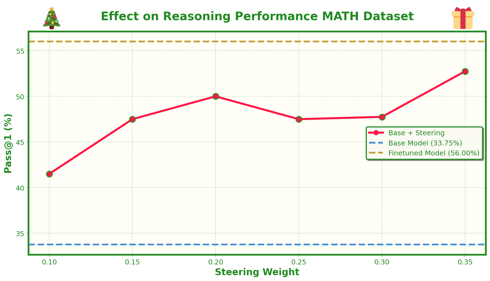

# Day 4: Steering Vectors for Reasoning Performance


## What's This About?

Steering vectors are a really interesting way to capture and transfer learned behavior between models. The idea is simple: if you can extract the difference between how a base model and a finetuned model process information, you can apply that difference to steer the base model's behavior without actually finetuning it.

Most work on steering vectors has focused on style, making models more helpful, more honest, or changing their tone. But what about reasoning? Can we extract the "reasoning boost" from a model that's been trained on math problems and apply it to a base model? That's what we're exploring here.

The approach is straightforward:
1. Train a model on the MATH dataset using GRPO 
2. Extract steering vectors by comparing activations between the base and finetuned models
3. Apply these vectors to the base model at different weights to see if we can boost reasoning performance

The cool thing about steering vectors is that they're lightweight (just a vector per layer), easy to apply (just add them to hidden states), and can be tuned with a single weight parameter. This makes them a really practical way to adapt models for different tasks or behaviors without needing to store multiple full model checkpoints.

We tested this with Qwen 2.5 7B on the MATH dataset, and the results are promising - steering vectors can indeed capture some of the reasoning improvements from finetuning, though they don't quite match the full finetuned model's performance. But the fact that we can get meaningful improvements with just a few vectors opens up interesting possibilities for model adaptation.

## Setup

First, make sure you have the dependencies installed. This project uses:
- PyTorch
- Transformers
- vLLM (optional, for faster generation)
- LigerKernel (optional, for fused GRPO loss)

The MATH dataset will be downloaded automatically from HuggingFace when you first run the training script.

## Training a Model

To train a model on the MATH dataset using GRPO:

```bash
uv run python main.py --output_dir final_run --use_vllm
```

Key arguments:
- `--output_dir`: Where to save checkpoints and logs (default: `final_baseline`)
- `--use_vllm`: Use vLLM server for faster generation (recommended)
- `--num_train_iters`: Number of training iterations (default: 1000)
- `--eval_every`: How often to evaluate (default: 50)
- `--save_every`: How often to save checkpoints (default: 50)
- `--num_chains`: Number of parallel generations per prompt during training (default: 8)
- `--num_completions_eval`: Number of completions per eval problem (default: 20)
- `--train-size`: Number of training examples (default: 12000)
- `--eval-size`: Number of eval examples (default: 20)

If using vLLM, you'll need to start the vLLM server separately:

```bash
NCCL_P2P_DISABLE=1 CUDA_VISIBLE_DEVICES=0 uv run vllm_server.py \
  --model Qwen/Qwen2.5-7B-Instruct --port 8000 --dtype bfloat16
```

Then run training with `--use_vllm` flag. The training script will automatically sync weights to the vLLM server after each optimizer step.

During training, you'll get:
- Training logs in `output_dir/run_log.json` with detailed examples
- Evaluation summaries in `output_dir/eval_summary.json` with pass@k metrics
- Checkpoints in `output_dir/checkpoint_step_N/` directories

## Building Steering Vectors

Once you have a trained model, you can extract steering vectors by comparing it to the base model:

```bash
uv run python build_steering_vectors.py \
  --base_model_name Qwen/Qwen2.5-7B-Instruct \
  --finetuned_checkpoint final_run/checkpoint_step_750 \
  --output_path steering_vectors.json \
  --max_examples 1000
```

This script:
1. Loads both the base model and finetuned checkpoint
2. Runs training examples through both models
3. Captures activations from each transformer layer
4. Computes steering vectors = mean(finetuned_activations) - mean(base_activations)
5. Saves the vectors to a JSON file

Key arguments:
- `--base_model_name`: Base model from HuggingFace
- `--finetuned_checkpoint`: Path to your trained checkpoint
- `--output_path`: Where to save steering vectors
- `--max_examples`: How many training examples to use (default: all)
- `--seed`: Random seed for reproducibility

The steering vectors are just the difference in mean activations per layer - simple but effective. Each vector has shape `(hidden_dim,)` and represents how the finetuned model's internal representations differ from the base model.

## Evaluating Steering Vectors

To test how well steering vectors work, run the evaluation script:

```bash
uv run python eval_with_steering.py \
  --base_model_name Qwen/Qwen2.5-7B-Instruct \
  --finetuned_checkpoint final_run/checkpoint_step_750 \
  --steering_vectors_path steering_vectors.json \
  --output_path steering_eval_results.json
```

This will:
1. Evaluate the base model
2. Evaluate the finetuned model
3. Evaluate the base model with steering vectors at different weights (0.1, 0.15, 0.2, 0.25, 0.3, 0.35 by default)

The script uses the same evaluation setup as training (same eval set, same generation parameters) to ensure fair comparison. Results are saved to a JSON file with detailed metrics for each configuration.

Key arguments:
- `--base_model_name`: Base model to use
- `--finetuned_checkpoint`: Finetuned checkpoint to compare against
- `--steering_vectors_path`: Path to steering vectors JSON file
- `--output_path`: Where to save evaluation results
- `--eval-size`: Number of eval problems (default: 20)
- `--num_completions_eval`: Completions per problem (default: 20)
- `--pass_at_k`: k for pass@k metric (default: 1)

## Plotting Results

Once you have evaluation results, create a nice plot:

```bash
uv run python plotter.py \
  --results-path steering_eval_results.json \
  --output-path plots/steering_results.png
```

This creates a Christmas-themed plot showing:
- Base model performance (horizontal line)
- Finetuned model performance (horizontal line)
- Base + steering at different weights (line plot)

The plot makes it easy to see how steering weight affects performance and whether steering vectors can match or exceed the finetuned model's performance.

## The Dataset

We're using the MATH dataset, which contains challenging mathematical reasoning problems across different subjects (algebra, geometry, number theory, etc.) and difficulty levels. Each problem requires multi-step reasoning to solve.

The training setup uses a specific format:
- System prompt instructs the model to put reasoning in `<think>` tags and the final answer in `<answer>` tags
- Rewards are based on both correctness (does the answer match ground truth?) and format (did it follow the tag structure?)
- We use pass@k as the main metric, which measures the probability that at least one of k attempts solves the problem

## How It Works

### Training

The training loop uses GRPO (Generalized Reward-Powered Optimization):
1. Sample a math problem from the training set
2. Generate multiple completions (chains) from the model
3. Score each completion based on correctness and format
4. Compute advantages (normalized rewards)
5. Update the model to increase probability of high-reward completions

The loss is the DR-GRPO variant, which normalizes by batch size and sequence length to make training stable across different problem sizes.

### Steering Vectors

Steering vectors are computed by:
1. Running the same inputs through both base and finetuned models
2. Capturing hidden states after each transformer layer
3. Computing the mean activation per layer for each model
4. Taking the difference: `steering_vector = mean(finetuned) - mean(base)`

When applied, we simply add the steering vector to the hidden states:
```
hidden_state = hidden_state + weight * steering_vector
```

The weight parameter controls how strongly to apply the steering - higher weights push the model more toward finetuned behavior, but can also introduce instability if too high.

### Evaluation

Evaluation uses the same setup as training:
- Same eval set (fixed by seed)
- Same generation parameters (temperature, max tokens, etc.)
- Same scoring (correctness + format)
- Pass@k metric computed across multiple completions per problem

This ensures fair comparison between base, finetuned, and steered models.

## Results

We evaluated everything on a 20-problem subset from the MATH dataset, measuring pass@1 accuracy.

**Baseline Performance:**
- **Base model (Qwen 2.5 7B Instruct)**: 33.75% pass@1
- **GRPO-finetuned model**: 56% pass@1

That's a solid 22 percentage point improvement from GRPO training. But can we capture some of that improvement with steering vectors instead of loading the full finetuned checkpoint?

**Building the Steering Vectors:**

We ran the entire training set through both the base and finetuned models, capturing activations at every transformer layer. The steering vector for each layer is simply the difference in mean activations: `steering_vector[layer] = mean(finetuned_activations) - mean(base_activations)`. This gives us 28 vectors (one per layer), each with dimension 3584.

**Applying Steering at Different Strengths:**




**Takeaways:**

The steering vectors do capture a significant portion of the reasoning improvements from finetuning, though they don't quite match the full finetuned model's performance. The relationship between steering weight and performance isn't strictly monotonic—there's some variance at different weights, likely due to the relatively small eval set.

What's notable is that this works at all for reasoning tasks. Most prior work on steering vectors focused on style (helpfulness, honesty, tone), but here we're successfully transferring learned mathematical reasoning patterns. The fact that we can get meaningful improvements with just a few vectors (a few MB vs several GB for a full checkpoint) opens up practical possibilities:

- Quickly adapting models to different tasks without loading new weights
- Exploring the effect of different training regimes
- Creating model variants without storing full checkpoints
- Understanding what the model learned during finetuning by examining where activations changed most
