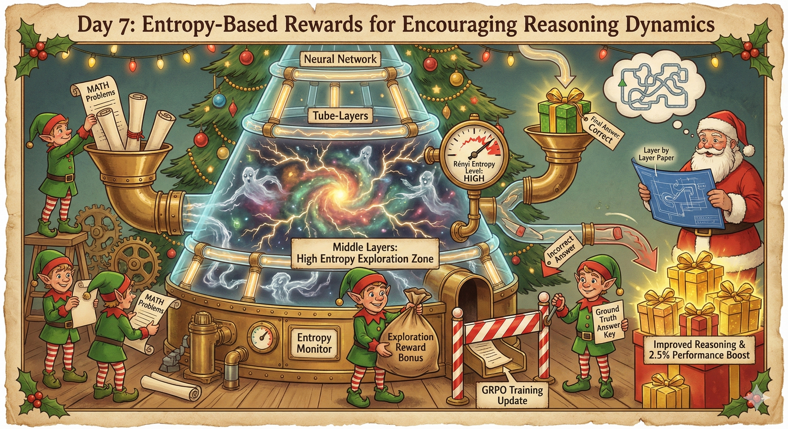
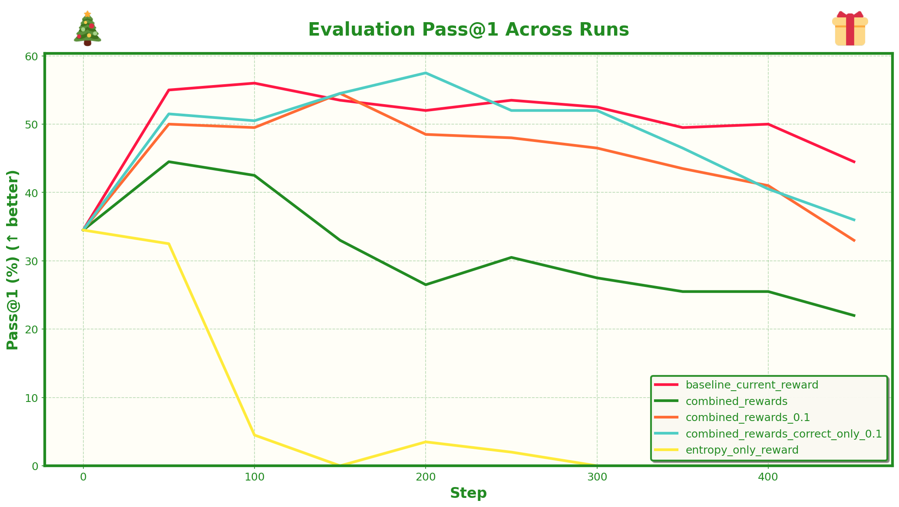
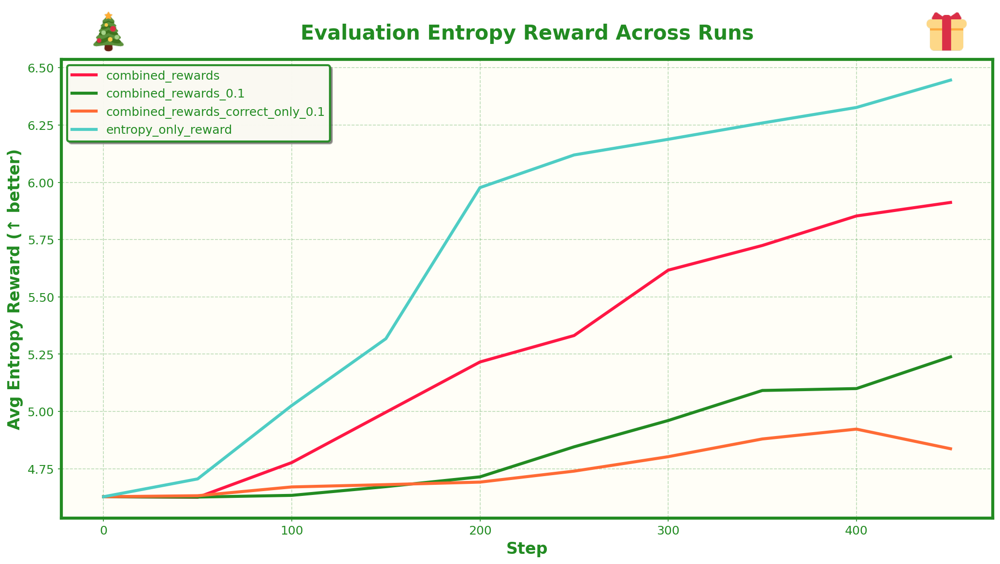

# Day 7: Entropy-Based Rewards for Encouraging Reasoning Dynamics


## What's This About?

There's this really interesting paper called ["Layer by Layer: Uncovering Hidden Representations in Language Models"](https://arxiv.org/abs/2502.02013) that challenges the conventional wisdom about how LLMs work. We usually just use the final layer embeddings, assuming earlier layers only capture low-level features. But the paper shows that intermediate layers can actually encode richer representations, often outperforming the final layer on downstream tasks.

More interestingly, they found that reasoning models (like Chain-of-Thought models) tend to have **higher entropy in the middle layers** compared to standard models. The idea is that these models are keeping more options "alive" during reasoning - they're exploring the solution space rather than collapsing to a single answer too early.

So I thought: what if we could encourage this kind of exploration during training? What if we reward the model for maintaining higher entropy in those middle layers, essentially teaching it to "think more" before committing to an answer?

The approach uses **matrix-based entropy** (Rényi entropy calculated on the eigenvalues of the Gram matrix) to measure how information is distributed in the hidden states. Higher entropy means the model is preserving more dimensionality and keeping more possibilities open, which seems to correlate with better reasoning.

## The Experiment

I implemented this as an auxiliary reward signal for GRPO training on the MATH dataset. The idea is:

1. During generation, extract hidden states from the middle ~10 layers
2. Compute the average entropy across these layers for the completion tokens only
3. Normalize entropy rewards within each group (z-score, scaled to [-0.1, 0.1])
4. Combine with the standard rewards (format correctness + answer correctness)

I tested three reward modes:
- **Current only**: Just format + correctness (baseline)
- **Combined**: Format + correctness + entropy rewards
- **Entropy only**: Just entropy rewards (pure exploration signal)

I also added an `--only_if_correct` flag that only rewards entropy when the answer is correct - this turned out to be the key to getting improvements!

## Results

The initial results were mixed. The entropy-only reward didn't improve performance, and the combined rewards didn't show clear benefits over the baseline. The model did learn to increase entropy in those middle layers when explicitly rewarded for it, but that didn't translate to better math problem solving.

But here's the interesting part - when I looked at the actual reasoning outputs, the higher-entropy runs produced some genuinely interesting (and honestly, kind of funny) reasoning. The model seemed to explore more possibilities, consider alternative approaches, and sometimes go down weird tangents before settling on an answer. It felt more like watching someone actually think through a problem, with all the false starts and reconsiderations that come with real reasoning, rather than the more direct, confident answers from the baseline.

Then I tried something: what if we only reward entropy when the answer is correct? The idea being that we want to encourage exploration, but only reward it when that exploration leads to the right answer. This is where it got promising - **using entropy rewards only on correct completions gave a 2.5% performance boost over the baseline**. 

### Accuracy (Pass@1)



### Entropy Across Training Runs



This is a promising result! Obviously there's a lot more to play with (scaling, layer selection, different entropy metrics), but it's exciting to see that encouraging entropy can improve results when properly conditioned on correctness. The fact that reasoning models naturally have higher entropy suggests there's something about these internal dynamics that matters. Maybe:

- The entropy reward needs better tuning (scaling, layer selection, etc.)
- We need a different way to encourage exploration (not just raw entropy)
- The loss formulation could be improved (maybe per-token entropy rewards instead of scalar?)
- There might be better ways to measure "reasoning-like" behavior beyond just entropy

It's a proof of concept that we can directly reward internal network dynamics, which opens up interesting directions for future work. Even if this particular approach didn't work, the idea of encouraging certain internal representations during training is worth exploring more.

## Setup

The code uses the MATH dataset from HuggingFace. No special setup needed - just make sure you have the dependencies installed (see the main project README).

## Training

You can run training with different reward modes:

```bash
# Baseline: just format + correctness rewards
uv run python src/day7/main.py \
    --output_dir runs/baseline_current_reward \
    --reward_mode current \
    --num_train_iters 500 \
    --eval_every 50 \
    --save_every 1000

# Entropy-only: just entropy rewards
uv run python src/day7/main.py \
    --output_dir runs/entropy_only_reward \
    --reward_mode entropy_only \
    --num_train_iters 500 \
    --eval_every 50 \
    --save_every 1000

# Combined: format + correctness + entropy
uv run python src/day7/main.py \
    --output_dir runs/combined_rewards \
    --reward_mode combined \
    --num_train_iters 500 \
    --eval_every 50 \
    --save_every 1000

# Combined with only_if_correct: only reward entropy when answer is correct (best results!)
uv run python src/day7/main.py \
    --output_dir runs/combined_rewards_correct_only \
    --reward_mode combined \
    --only_if_correct \
    --num_train_iters 500 \
    --eval_every 50 \
    --save_every 1000
```

Key arguments:
- `--reward_mode`: `current`, `combined`, or `entropy_only`
- `--only_if_correct`: Only reward entropy when answer is correct (recommended for best results)
- `--output_dir`: Where to save logs and checkpoints
- `--num_train_iters`: Number of training iterations
- `--eval_every`: How often to run evaluation
- `--save_every`: How often to save model checkpoints
- `--num_chains`: Number of parallel generations per prompt (default: 8)
- `--learning_rate`: Learning rate (default: 5e-6)
- `--use_liger`: Use LigerKernel for faster training (optional)

During training, you'll get:
- Training logs in `output_dir/run_log.json` (detailed per-step logs)
- Evaluation summaries in `output_dir/eval_summary.json` (just metrics per step)
- Model checkpoints in `output_dir/checkpoint_step_N/`

## Evaluation

Evaluation runs automatically during training at the intervals specified by `--eval_every`. The script:
- Samples multiple completions per eval problem (default: 20)
- Computes pass@k metrics
- Tracks format rewards and entropy rewards (if enabled)
- Logs everything to JSON files

You can also check the `eval_summary.json` file for a quick overview of metrics over time.

## Plotting

Once you have multiple runs, generate comparison plots:

```bash
uv run python src/day7/plotter.py --runs-dir runs --output-dir plots
```

This creates several plots in the `plots/` directory:
1. **Evaluation Pass@1** - Shows how pass@1 changes over training for each run
2. **Evaluation Format Reward** - Average format correctness over time
3. **Evaluation Entropy Reward** - Average entropy in middle layers (if entropy rewards were used)
4. **Training Loss** - Training loss curves for comparison

All plots use the same Christmas-themed styling (matching the rest of the advent project) with different colors for each run and moving averages.

## How It Works

The entropy computation follows the "Layer by Layer" paper:

1. **Matrix-based Entropy**: For each hidden state matrix Z (seq_len × hidden_dim), we compute the Gram matrix Z Z^T or Z^T Z (whichever is smaller for efficiency)
2. **Eigenvalue Analysis**: Extract eigenvalues and normalize them to create a probability distribution
3. **Rényi Entropy**: Compute Shannon entropy (Rényi with α=1.0) as: -Σ(p_i log₂(p_i))
4. **Layer Averaging**: Average entropy across the middle 10 layers for each completion
5. **Group Normalization**: Z-score normalize within each problem's completions, then scale to [-0.1, 0.1]

The GRPO loss then uses these entropy rewards (either alone or combined with format/correctness) to update the model. The idea is that higher entropy in middle layers = more exploration = better reasoning.

## The Dataset

We're using the MATH dataset, which contains high school and competition-level math problems. Each problem has:
- A problem statement (the question)
- A ground truth answer
- Subject and difficulty level metadata

The model is trained to:
1. Reason step-by-step (in `<think>` tags)
2. Provide a final answer (in `<answer>` tags)

Rewards come from:
- **Format reward**: +0.2 if both tags are present, -0.5 if wrong format
- **Correctness reward**: +1.0 if answer matches ground truth, 0.0 otherwise
- **Entropy reward**: Normalized entropy in middle layers (if enabled)

## Technical Details

The implementation:
- Uses Qwen 2.5 7B Instruct as the base model
- Supports optional LigerKernel for faster, more stable GRPO loss computation
- Computes entropy during generation (requires a forward pass with `output_hidden_states=True`)
- Handles variable-length sequences and EOS tokens properly
- Groups completions by problem for proper normalization

The entropy computation is done on completion tokens only (not the prompt), focusing on the model's reasoning process rather than its understanding of the question.

## Future Directions

Even though this particular approach didn't show clear benefits, I think there's potential here:

1. **Better entropy metrics**: Maybe we need different ways to measure "reasoning-like" behavior
2. **Per-token rewards**: Instead of scalar entropy per completion, reward entropy at each reasoning step
3. **Layer selection**: Maybe different layers matter for different types of reasoning
4. **Combined signals**: Entropy + other internal dynamics (attention patterns, activation sparsity, etc.)
5. **Curriculum learning**: Start with high entropy rewards, then gradually shift to correctness

The fact that we can directly reward internal network dynamics opens up a lot of interesting possibilities. It's a different way of thinking about training - not just "get the right answer" but "think in the right way."
