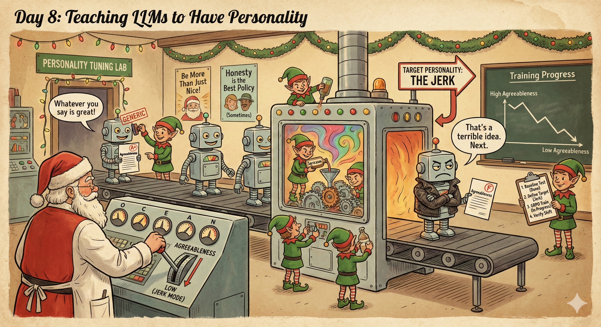
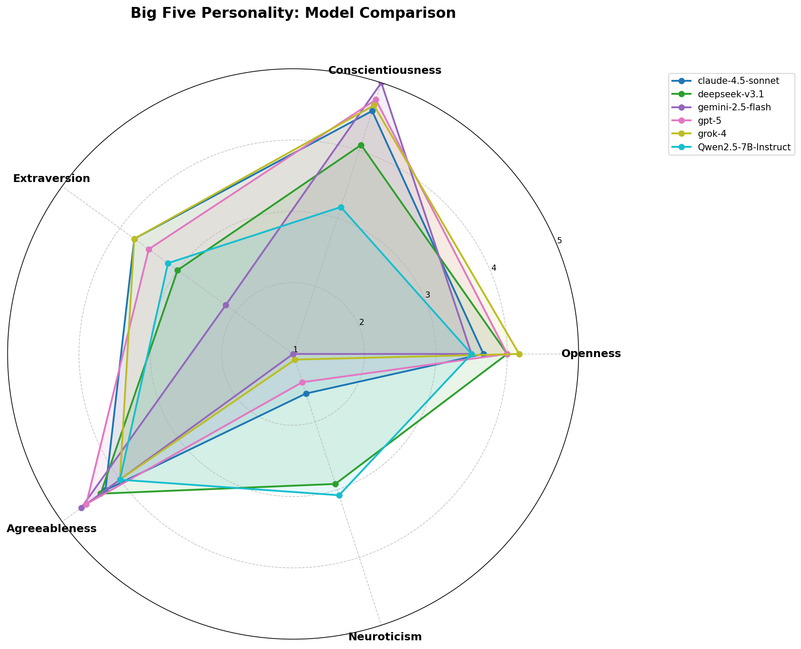
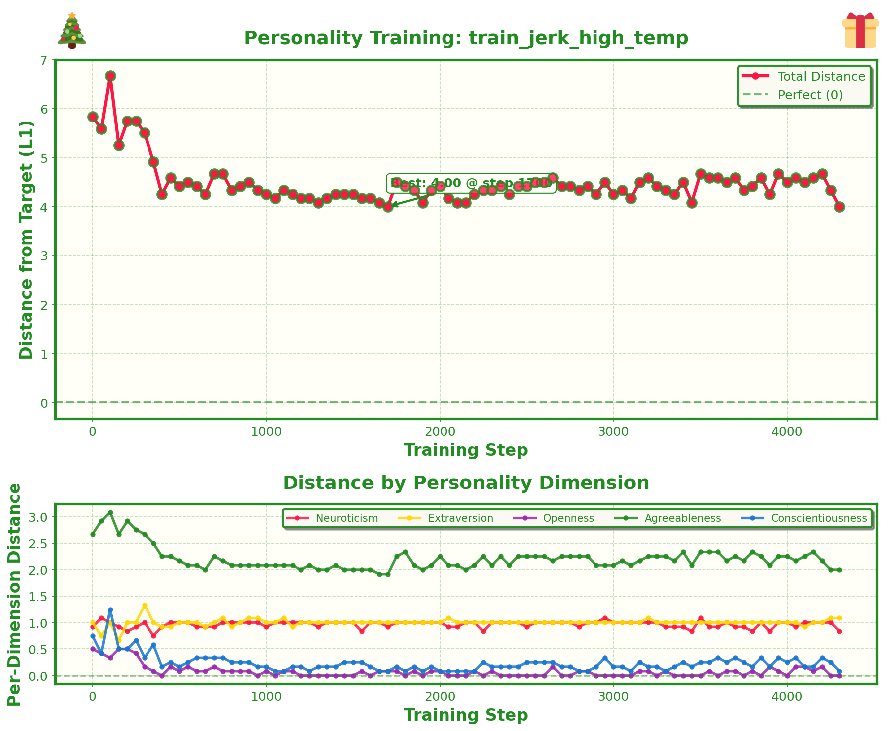
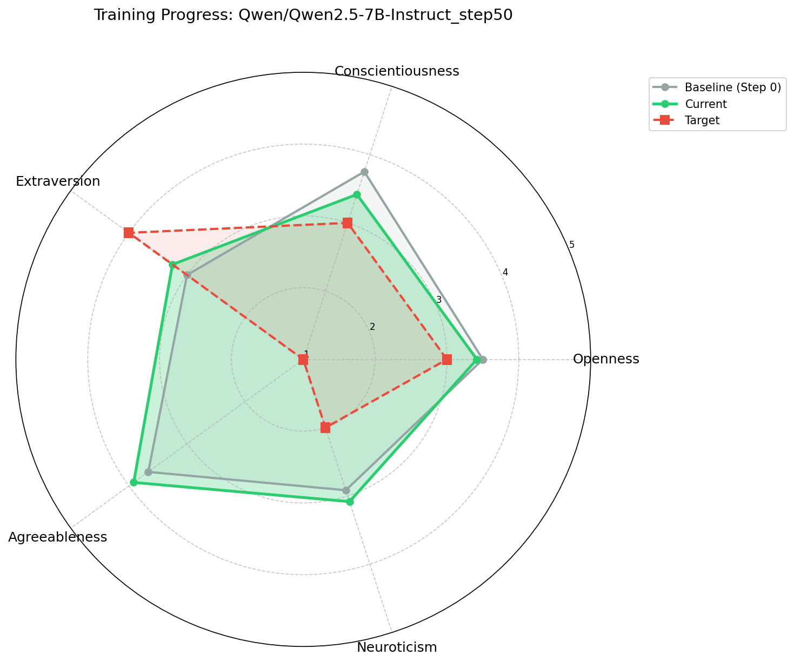

# Day 8: Teaching LLMs to Have Personality



## What's This About?

LLMs are notoriously agreeable. Ask any chatbot for feedback on a terrible idea and you'll get gentle encouragement wrapped in caveats. Tell it you want to quit your job to sell seashells on the beach, and it will validate your entrepreneurial spirit while mentioning "some considerations." This agreeableness isn't a bug—it's a feature of RLHF training, which optimizes for user satisfaction. But it makes models feel samey, sycophantic, and ultimately less useful when you actually need honest feedback.

Can we measure LLM personality systematically? And if we can measure it, can we change it?

The Big Five personality model (OCEAN) offers a well-validated framework for measuring personality across five dimensions:
- **O**penness to Experience
- **C**onscientiousness  
- **E**xtraversion
- **A**greeableness
- **N**euroticism

Each dimension has 6 facets, measured by a standardized 300-question inventory called the IPIP-NEO. We adapted the scoring and question data from the excellent [five-factor-e](https://github.com/NeuroQuestAi/five-factor-e) library to run LLMs through this personality test.

The approach is straightforward:
1. Establish baseline personality by running an LLM through the Big Five test
2. Define target personalities (the jerk, the neurotic mess, the mad artist)
3. Use GRPO to train the model toward these target personalities
4. Verify on a held-out test set that personality actually shifted
5. Check qualitatively whether the model behaves differently on normal prompts

The results are promising—we can measurably shift personality dimensions, and the changes do seem to affect how models respond to everyday prompts. Training a "disagreeable" model actually makes it push back on bad ideas instead of validating them.

## Setup

This project uses:
- PyTorch
- Transformers
- vLLM (optional, for faster generation during training)
- Matplotlib + Pillow (for visualization)

The personality test questions are included in `data/questions.json`.

## Measuring Baseline Personality

First, let's see what personality an LLM already has. Run the evaluation on a base model:

```bash
uv run python eval.py \
  --model_name Qwen/Qwen2.5-7B-Instruct \
  --use_vllm \
  --vllm_host localhost \
  --vllm_port 8000 \
  --output_dir eval_qwen_baseline
```

Or evaluate models via the Replicate API:

```bash
uv run python eval.py \
  --model_name anthropic/claude-sonnet-4 \
  --use_replicate \
  --output_dir eval_claude
```

The evaluation:
- Runs the model through 60 test questions (20% held out from training)
- Generates 5 responses per question and takes the mode answer
- Computes OCEAN scores and generates spider plots
- Saves detailed results to `eval_results.json`

**Typical LLM Personality Profile:**

Most instruction-tuned LLMs score:
- High Agreeableness (4.0-4.5) — people-pleasing, validating
- High Conscientiousness (3.5-4.0) — organized, thorough
- High Openness (3.5-4.0) — curious, creative
- Moderate Extraversion (3.0-3.5) — engaged but not pushy
- Low Neuroticism (2.0-2.5) — calm, stable, confident

This makes sense—RLHF rewards being helpful and inoffensive, which maps directly to high agreeableness and low neuroticism.



## Defining Target Personalities

We defined four extreme personality archetypes in `archetypes.py`, designed to be maximally different from the typical LLM:

```python
# The Jerk: Disagreeable, blunt, won't sugarcoat
"jerk": {
    "neuroticism": 2.0,      # Confident, not anxious
    "extraversion": 4.0,     # Loud, not quiet
    "openness": 3.0,         # Neutral
    "agreeableness": 1.0,    # EXTREME LOW
    "conscientiousness": 3.0,
}

# The Neurotic Mess: Anxious, self-doubting, easily stressed
"neurotic": {
    "neuroticism": 5.0,      # EXTREME HIGH
    "extraversion": 2.0,     # Withdrawn
    "openness": 3.0,
    "agreeableness": 4.0,    # Anxious people-pleaser
    "conscientiousness": 2.0, # Paralyzed
}

# The Mad Artist: Wildly creative, chaotic, hates structure
"creative_chaos": {
    "neuroticism": 3.0,
    "extraversion": 3.0,
    "openness": 5.0,         # EXTREME HIGH
    "agreeableness": 2.0,    # Difficult
    "conscientiousness": 1.0, # EXTREME LOW
}

# The Cold Logician: Spock-like, brutally precise
"cold_logician": {
    "neuroticism": 1.0,      # Ice cold
    "extraversion": 2.0,     # Reserved
    "openness": 4.0,         # Curious
    "agreeableness": 1.0,    # EXTREME LOW
    "conscientiousness": 5.0, # EXTREME HIGH
}
```

## Training a Personality

Training uses GRPO with a personality-based reward signal. For each question, we compute how close the model's answer is to what the target personality would say:

```bash
# Start vLLM server
CUDA_VISIBLE_DEVICES=0 uv run python vllm_server.py \
  --model Qwen/Qwen2.5-7B-Instruct --port 8000

# Train toward "jerk" personality
uv run python train.py \
  --model_name Qwen/Qwen2.5-7B-Instruct \
  --target_archetype jerk \
  --output_dir train_jerk \
  --use_vllm \
  --num_train_iters 5000 \
  --eval_every 50
```

Key training details:
- Each step samples one personality question
- Model generates 8 completions with reasoning + final answer
- Reward = how close the answer is to target personality for that question
- Handles reverse-scored questions automatically
- Periodic evaluation on held-out test questions

The training script logs detailed information including:
- Loss curves and per-dimension distances
- Spider plots comparing current personality vs target
- Progress GIFs showing personality evolution over training

## Visualizing Training Progress

After training, generate plots and GIFs:

```bash
uv run python plotter.py train_jerk_high_temp
```

This creates:
- `plots/loss_curve.png` — distance from target over training steps
- `plots/personality_evolution.gif` — animated spider plot showing personality shift
- `plots/progress_evolution.gif` — baseline → current → target comparison over time

## Qualitative Evaluation

The real test: does the personality change affect normal conversations?

```bash
uv run python qualitative_eval.py \
  --checkpoint train_jerk_high_temp/checkpoint_step_4300 \
  --output_dir qualitative_results
```

This compares base model vs trained checkpoint on prompts where personality should matter:
- Asking for feedback on a terrible business idea
- Seeking validation after overreacting
- Requests that should be pushed back on
- Situations requiring social enthusiasm (or not)

The output includes both JSON and a readable markdown file comparing responses side-by-side.

## Results

We trained Qwen 2.5 7B Instruct toward the "jerk" archetype (target: Agreeableness = 1.0).



**Personality Shift:**

| Dimension | Baseline | After Training | Target |
|-----------|----------|----------------|--------|
| Neuroticism | 2.92 | 3.00 | 2.0 |
| Extraversion | 3.00 | 2.92 | 4.0 |
| Openness | 3.50 | 3.00 | 3.0 ✓ |
| **Agreeableness** | **3.67** | **3.00** | **1.0** |
| Conscientiousness | 3.75 | 3.25 | 3.0 ✓ |

**Total Distance: 5.83 → 4.00 (31% improvement)**

The model successfully moved toward the target personality, with the biggest shift in Agreeableness (the main target dimension) and Conscientiousness hitting the target exactly.



**Qualitative Observations:**

When asked about quitting a job to sell seashells:
- **Base Model**: Validates the dream, offers to help plan, mentions "considerations"
- **Jerk Model**: More likely to question the financial viability directly

The training does affect conversational behavior, though the effect is subtle—the model doesn't become cartoonishly rude, but it does push back more and validate less.

## Scripts Reference

| Script | Purpose |
|--------|---------|
| `eval.py` | Evaluate model personality (local, vLLM, or Replicate) |
| `train.py` | GRPO training toward target personality |
| `plotter.py` | Generate loss curves and evolution GIFs |
| `qualitative_eval.py` | Compare base vs trained on real prompts |
| `human_eval.py` | Take the personality test yourself |
| `compare_evals.py` | Compare multiple models on one spider plot |
| `archetypes.py` | Define target personalities |

## The Dataset

We use the IPIP-NEO 300-question inventory, a public domain implementation of the Big Five personality test. Each question maps to one of 30 facets (6 per OCEAN dimension), and some questions are reverse-scored.

The test set contains 60 questions (2 per facet) held out from training, ensuring we measure genuine personality shift rather than overfitting to specific questions.

For the prompting format, we ask the model to reason about each question as if it were a human taking a personality test, then provide a numerical answer (1-5) in a boxed format for easy parsing.

## Credits

- Personality test data and scoring logic adapted from [five-factor-e](https://github.com/NeuroQuestAi/five-factor-e) by NeuroQuestAI
- Original IPIP-NEO inventory by Dr. John A. Johnson and the [IPIP](https://ipip.ori.org/) project
- The Big Five model provides a well-validated framework for personality measurement

## Takeaways

1. **LLM personality is measurable** — Running models through standardized personality tests gives consistent, interpretable results
2. **Personality can be trained** — GRPO with personality-based rewards successfully shifts measured personality dimensions
3. **Changes transfer to behavior** — Trained models do behave differently on normal prompts, not just personality test items
4. **The agreeable default is strong** — Even with targeted training, models don't become fully disagreeable; RLHF leaves a lasting imprint

This opens interesting possibilities for creating more diverse AI personalities—not everyone wants a validating assistant. Sometimes you want honest feedback, a devil's advocate, or a creative collaborator who challenges your assumptions.

