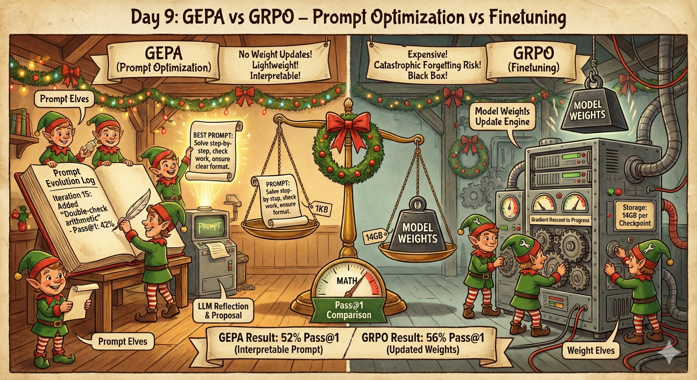
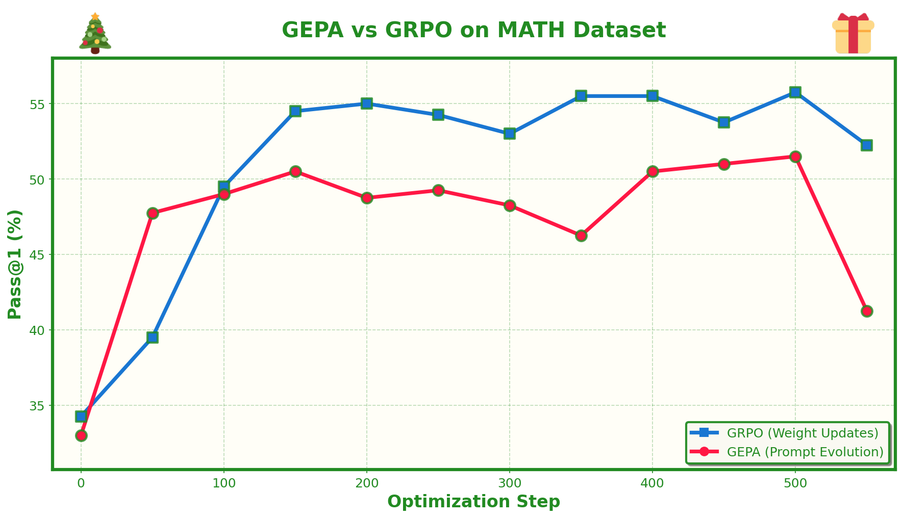

# Day 9: GEPA vs GRPO - Prompt Optimization vs Finetuning



## What's This About?

I've become really interested in GEPA (Genetic-Pareto Prompt Optimizer) as a method for improving model performance. The appeal is simple: in most real-world cases, you don't actually want to finetune your model. Finetuning is expensive, requires careful hyperparameter tuning, can cause catastrophic forgetting, and leaves you with model weights you need to store and deploy.

Prompt optimization, on the other hand, feels like a novel and elegant way to learn. Instead of updating millions of model parameters, you evolve the prompt text itself. The model stays frozen, you just get better at talking to it. This has some really nice properties:

- **No weight updates**: The base model never changes, so no risk of forgetting
- **Lightweight**: You're just storing text, not gigabytes of weights
- **Interpretable**: You can read and understand what changed
- **Transferable**: A good prompt might work across different models

GEPA takes this idea and makes it systematic. It maintains a pool of candidate prompts, evaluates them on training examples, uses an LLM to reflect on failures and propose improvements, and uses Pareto-based selection to maintain diversity. It's essentially evolutionary optimization with LLM-powered mutation.

The question I wanted to answer: on the MATH dataset, can GEPA do as well as GRPO? GRPO updates model weights to improve reasoning, while GEPA only evolves the prompt. Both are given the same training data and evaluation schedule, so we can compare them directly.

## Setup

This project uses `uv` for dependency management. Make sure you have it installed, then all dependencies will be handled automatically when you run the scripts.

You'll also need:
- An OpenAI API key (for the GEPA optimizer model)
- GPUs for running the task model and vLLM server

## How GEPA Works

The GEPA algorithm is surprisingly simple:

1. **Initialize**: Start with a seed prompt (same one GRPO uses)
2. **Select Parent**: Pick a candidate prompt using Pareto-based sampling (favoring prompts that are best on different problem instances)
3. **Sample Minibatch**: Grab a few training problems
4. **Evaluate & Collect Traces**: Run the model with the parent prompt, record inputs, outputs, and whether each was correct
5. **Reflect & Propose**: Send the traces to an optimizer LLM (GPT-4.1) which analyzes failures and proposes an improved prompt
6. **Gate on Minibatch**: Only accept the new prompt if it scores better on the same minibatch
7. **Evaluate on Validation**: Score the new prompt on the full validation set
8. **Repeat**: Go back to step 2

The key insight is using an LLM for reflection. Instead of random mutations, GPT-4.1 looks at concrete examples of what went wrong and proposes targeted improvements. It might notice the model is making arithmetic errors and add "double-check your calculations" to the prompt, or see format issues and clarify the expected output structure.

## Running GEPA

First, start a vLLM server for the task model:

```bash
vllm serve Qwen/Qwen2.5-7B-Instruct --port 8001
```

Then run GEPA:

```bash
./run_gepa.sh
```

Or manually:

```bash
uv run python gepa_main.py \
    --model_name Qwen/Qwen2.5-7B-Instruct \
    --use_vllm \
    --vllm_port 8001 \
    --optimizer_model gpt-4.1 \
    --output_dir gepa_qwen7b_run \
    --num_iters 1000 \
    --eval_every 50
```

Key arguments:
- `--model_name`: The task model (what solves the math problems)
- `--optimizer_model`: The LLM that reflects and proposes new prompts (default: gpt-4.1)
- `--minibatch_size`: Problems per optimization step (default: 4)
- `--candidate_selection`: How to pick parent prompts - `pareto` or `best`
- `--eval_every`: How often to run full evaluation (default: 50)

GEPA outputs:
- `optimization_log.txt`: Human-readable log of the entire optimization process
- `best_prompt.txt`: The current best prompt
- `all_candidates.json`: All evolved prompts with their scores
- `eval_summary.json`: Pass@k metrics at each eval step (same format as GRPO)
- `run_log.json`: Detailed logs including reflections and meta-prompts

## Running GRPO (for comparison)

GRPO uses TRL's vLLM server which supports weight syncing:

```bash
# Terminal 1: Start vLLM server
NCCL_P2P_DISABLE=1 CUDA_VISIBLE_DEVICES=0 uv run vllm_server.py \
    --model Qwen/Qwen2.5-7B-Instruct --port 8000 --dtype bfloat16

# Terminal 2: Run training
NCCL_P2P_DISABLE=1 CUDA_VISIBLE_DEVICES=1,2,3 ./run_grpo.sh
```

Or manually:

```bash
uv run python main.py \
    --model_name Qwen/Qwen2.5-7B-Instruct \
    --use_vllm \
    --vllm_port 8000 \
    --output_dir grpo_qwen7b_run \
    --num_train_iters 1000 \
    --eval_every 50
```

Both scripts are configured to use the same:
- Seed (7111994)
- Training set size (12000)
- Evaluation set size (20)
- Evaluation frequency (every 50 steps)
- Generation parameters (temperature 0.9, max 512 tokens)
- Metrics (pass@1 with 20 completions)

This ensures a fair comparison between the two methods.

## Comparing Results

Both methods output `eval_summary.json` with the same format:

```json
{
  "0": {"pass_at_1": 35.0, "avg_format_reward": 0.95},
  "50": {"pass_at_1": 42.0, "avg_format_reward": 0.98},
  ...
}
```

You can plot these directly to compare GEPA vs GRPO learning curves at each evaluation step.

## The Key Difference

| Aspect | GRPO | GEPA |
|--------|------|------|
| What changes | Model weights | Prompt text |
| Update mechanism | Gradient descent | LLM reflection |
| Storage cost | ~14GB per checkpoint | ~1KB per prompt |
| Compute | Backprop through model | Forward passes only |
| Reversibility | Hard to undo | Just use old prompt |
| Interpretability | Black box | Can read the prompt |

GRPO learns by updating the model's internal representations. GEPA learns by finding better ways to communicate with the model. Both aim for the same goal: better math reasoning. The question is which approach is more effective, and under what conditions.

## Files

- `gepa_main.py`: Clean, readable GEPA implementation
- `main.py`: GRPO training script (same as day4)
- `vllm_server.py`: TRL's vLLM server with weight sync support
- `run_gepa.sh`: Script to run GEPA
- `run_grpo.sh`: Script to run GRPO
- `math_dataset.py`: MATH dataset loading
- `utils.py`: Shared utilities (scoring, formatting, etc.)

## Results



